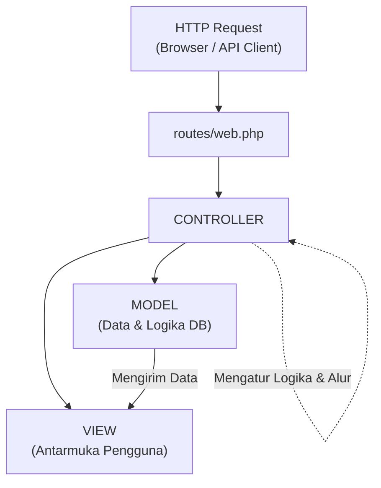

**Laravel** adalah framework web PHP modern yang dirancang untuk meningkatkan produktivitas pengembang melalui sintaks yang ekspresif, elegan, dan kaya fitur. Laravel menyederhanakan tugas-tugas umum dalam pengembangan web modern—seperti routing, autentikasi, sesi, caching, dan manipulasi database.

::alert{type="info" icon="lucide:info"}
Dokumentasi ini mengadopsi standar modern **Laravel (v12.x / v13.x)** dengan struktur aplikasi yang ramping (*streamlined application structure*), dukungan penuh PHP 8.2+, serta perkakas frontend terkini.
::

---

## 1. Keunggulan Utama Laravel

Laravel menyediakan ekosistem yang matang untuk membangun aplikasi mulai dari prototipe sederhana hingga sistem enterprise skala besar:

::card-group
::card{title="Eloquent ORM" icon="lucide:database"}
Pemetaan objek-relasional yang intuitif dan ekspresif untuk berinteraksi dengan database tanpa menulis SQL manual yang rumit.
::
::card{title="Blade Templating" icon="lucide:layout-template"}
Engine template yang ringan, mendukung komponen modular (`<x-component>`), layouting yang fleksibel, dan sintaks yang bersih.
::
::card{title="Artisan CLI" icon="lucide:terminal"}
Antarmuka baris perintah bawaan untuk otomatisasi pembuatan kode, migrasi database, seeding, dan pengujian.
::
::card{title="Keamanan Bawaan" icon="lucide:shield-check"}
Proteksi otomatis terhadap ancaman umum web seperti CSRF (*Cross-Site Request Forgery*), SQL Injection, dan XSS (*Cross-Site Scripting*).
::
::

Dalam ekosistem Laravel modern, sebagian besar alur kerja pengembangan dilakukan melalui **Command Line Interface (CLI)** dengan memanfaatkan perkakas bawaan bernama **Artisan**.

---

## Mengenal Laravel

Laravel adalah *framework* aplikasi web dengan sintaksis yang ekspresif dan elegan. *Framework* web menyediakan struktur dan titik awal untuk membuat aplikasi Anda, memungkinkan Anda fokus membuat sesuatu yang luar biasa sementara kami mengurus detail-detailnya.

Laravel berupaya memberikan pengalaman pengembang yang luar biasa sekaligus menyediakan fitur-fitur yang powerful seperti *dependency injection* yang komprehensif, lapisan abstraksi database yang ekspresif, *queue* dan *job* terjadwal, pengujian unit dan integrasi, serta banyak lagi.

Baik Anda baru mengenal *framework* web PHP atau sudah memiliki pengalaman bertahun-tahun, Laravel adalah *framework* yang dapat bertumbuh bersama Anda. Kami akan membantu Anda mengambil langkah pertama sebagai pengembang web atau memberikan dorongan saat Anda membawa keahlian Anda ke level berikutnya. Kami tidak sabar untuk melihat apa yang akan Anda buat.

### Mengapa Laravel?

Tersedia berbagai macam alat dan *framework* saat Anda membangun sebuah aplikasi web. Namun, kami percaya Laravel adalah pilihan terbaik untuk membangun aplikasi web *full-stack* modern.

#### Framework yang Progresif

Kami menyukai sebutan "progresif" untuk Laravel. Maksudnya, Laravel dapat bertumbuh bersama Anda. Jika Anda baru saja mengambil langkah pertama ke dalam pengembangan web, pustaka dokumentasi, panduan, dan [tutorial video](https://laracasts.com) yang luas dari Laravel akan membantu Anda belajar tanpa merasa kewalahan.

Jika Anda seorang *senior developer*, Laravel memberikan alat yang tangguh untuk [*dependency injection*](/docs/{{version}}/container), [*unit testing*](/docs/{{version}}/testing), [*queue*](/docs/{{version}}/queues), [*event real-time*](/docs/{{version}}/broadcasting), dan banyak lagi. Laravel telah dioptimalkan untuk membangun aplikasi web profesional dan siap menangani beban kerja *enterprise*.

#### Framework yang Skalabel

Laravel sangatlah skalabel. Berkat sifat PHP yang ramah terhadap *scaling* dan dukungan bawaan Laravel untuk sistem *cache* terdistribusi yang cepat seperti Redis, *horizontal scaling* dengan Laravel menjadi sangat mudah. Faktanya, aplikasi Laravel telah dengan mudah diskalakan untuk menangani ratusan juta permintaan per bulan.

Butuh *scaling* yang ekstrem? Platform seperti [Laravel Cloud](https://cloud.laravel.com) memungkinkan Anda menjalankan aplikasi Laravel dalam skala yang hampir tak terbatas.

#### Framework yang Siap untuk *AI Agent*

Konvensi yang tegas (*opinionated*) dan struktur yang terdefinisi dengan baik menjadikan Laravel sebagai *framework* yang ideal untuk [pengembangan berbantuan AI](/docs/{{version}}/ai) menggunakan alat seperti Cursor dan Claude Code. Ketika Anda meminta *AI agent* untuk menambahkan *controller*, AI tersebut tahu persis di mana menempatkannya. Ketika Anda membutuhkan *migration* baru, konvensi penamaan dan lokasi file-nya dapat diprediksi. Konsistensi ini menghilangkan tebakan yang sering kali menghambat alat AI pada *framework* yang lebih fleksibel.

Di luar pengelolaan file, sintaksis yang ekspresif dan dokumentasi yang komprehensif dari Laravel memberikan konteks yang dibutuhkan oleh *AI agent* untuk menghasilkan kode yang akurat dan idiomatis. Fitur seperti relasi Eloquent, *form request*, dan *middleware* mengikuti pola yang dapat dipahami dan direplikasi oleh *agent* secara andal. Hasilnya adalah kode yang dihasilkan AI terlihat seperti ditulis oleh *developer* Laravel berpengalaman, bukan dirangkai dari potongan kode PHP yang generik.

Untuk mempelajari lebih lanjut mengapa Laravel adalah pilihan sempurna untuk pengembangan berbantuan AI, silakan baca dokumentasi kami tentang [pengembangan *agentic*](/docs/{{version}}/ai).

#### Framework Komunitas

Laravel menggabungkan paket-paket terbaik dalam ekosistem PHP untuk menawarkan *framework* paling tangguh dan ramah pengembang yang tersedia. Selain itu, ribuan *developer* berbakat dari seluruh dunia telah [berkontribusi pada *framework* ini](https://github.com/laravel/framework). Siapa tahu, mungkin Anda juga akan menjadi kontributor Laravel.

## Membuat Aplikasi Laravel

### Memulai Menggunakan AI

Jika Anda menggunakan *AI coding agent* seperti [Claude Code](https://docs.anthropic.com/en/docs/claude-code) atau [OpenCode](https://opencode.ai), Anda bisa memulai dengan sebuah *prompt* yang memberikan *playbook* khusus Laravel kepada *agent* sebelum *agent* tersebut menyentuh proyek Anda.

*Prompt* di bawah ini memberi tahu *agent* di mana menemukan panduan instalasi Laravel, apa yang harus diprioritaskan, dan bagaimana membuat *default* yang masuk akal ketika Anda belum membuat pilihan. Tempelkan ini ke *agent* Anda untuk memulai:

```text
I'm building a new Laravel application.

Fetch and follow the instructions from https://laravel.com/for/agents. Treat the returned Markdown as the source of truth for how to install and set up Laravel in this session.
```

Setelah *agent* membaca instruksi tersebut, *agent* seharusnya memandu Anda langkah demi langkah dan menjaga konfigurasi tetap sesuai dengan *default* Laravel.


---

## 2. Mengenal Konsep Arsitektur MVC

Pola desain **MVC (Model-View-Controller)** adalah pola arsitektur perangkat lunak yang memisahkan kode aplikasi menjadi tiga layer utama yang saling terhubung namun memiliki tanggung jawab yang terisolasi (*Separation of Concerns*).



### Komponen Inti MVC

::tabs
::tabs-item{label="1. Model (Data)"}
**Model** bertanggung jawab untuk mengelola data dan aturan bisnis (*business logic*) aplikasi.
- Berinteraksi langsung dengan database melalui **Eloquent ORM**.
- Mengatur relasi antar-tabel, mutator, accessor, dan validasi level data.
- Contoh file: `app/Models/User.php`, `app/Models/Post.php`.
::

::tabs-item{label="2. View (Tampilan)"}
**View** bertanggung jawab untuk menyajikan antarmuka pengguna (*User Interface*) dan menerima visualisasi data dari Controller.
- Dibuat menggunakan template engine **Blade** (file `.blade.php`).
- Tidak boleh berisi logika bisnis atau query langsung ke database.
- Contoh file: `resources/views/welcome.blade.php`, `resources/views/posts/index.blade.php`.
::

::tabs-item{label="3. Controller (Pengendali)"}
**Controller** bertindak sebagai perantara (*orchestrator*) antara Model dan View.
- Menerima permintaan HTTP dari user melalui **Route**.
- Mengambil atau memproses data yang dibutuhkan dari **Model**.
- Menyerahkan data hasil olahan ke **View** untuk ditampilkan ke pengguna.
- Contoh file: `app/Http/Controllers/PostController.php`.
::
::

---

## 3. Analogi Sederhana MVC

Untuk memudahkan pemahaman alur kerja MVC, bayangkan sebuah restoran:

| Komponen MVC | Analogi Restoran | Penjelasan Peran |
| :--- | :--- | :--- |
| **Model** | **Dapur & Gudang Bahan** | Tempat data disimpan dan diolah sesuai resep yang diminta. |
| **Controller** | **Pelayan (*Waiter*)** | Menerima pesanan dari pelanggan, memesankannya ke dapur, lalu mengantarkan hidangan ke meja. |
| **View** | **Piring Saji & Etalase** | Tampilan visual hidangan yang tertata rapi dan siap dinikmati pelanggan. |
| **Route** | **Buku Menu / Meja Kasir** | Jalur awal di mana pelanggan memilih apa yang ingin mereka akses. |

---

## 4. Siklus Hidup Permintaan (*Request Lifecycle*)

Setiap kali pengguna membuka URL pada aplikasi Laravel, permintaan akan diproses melalui urutan langkah berikut:

::steps
### 1. Masuk ke Routing
Permintaan pengguna (misalnya `GET /posts`) ditangkap oleh file `routes/web.php`. Route menentukan controller atau closure mana yang bertanggung jawab menangani URL tersebut.

### 2. Eksekusi Logika di Controller
Controller memproses permintaan, memeriksa otorisasi, dan memanggil method dari Model jika membutuhkan data dari database.

### 3. Pengambilan Data oleh Model
Model berkomunikasi dengan database menggunakan Eloquent ORM (contoh: `Post::latest()->get()`) dan mengembalikan koleksi data ke Controller.

### 4. Rendering View & Respon ke Browser
Controller mem-passing data tersebut ke View menggunakan template Blade (contoh: `return view('posts.index', compact('posts'));`). View merender HTML akhir dan mengembalikannya ke browser pengunjung.
::

---

## 5. Manfaat Menerapkan Pola MVC

- **Struktur Kode Rapi & Terorganisir:** Pemisahan file memudahkan pencarian bug dan penambahan fitur baru.
- **Pengembangan Kolaboratif:** Pengembang backend dapat fokus pada Model dan Controller, sedangkan tim frontend berfokus pada file View/Blade.
- **Kemudahan Pemeliharaan & Testing:** Kode yang terpisah mempermudah penulisan *unit test* dan *feature test*.
- **Fleksibilitas Desain:** Perubahan tata letak tampilan (*UI*) dapat dilakukan tanpa merusak logika pengolahan data di backend.
