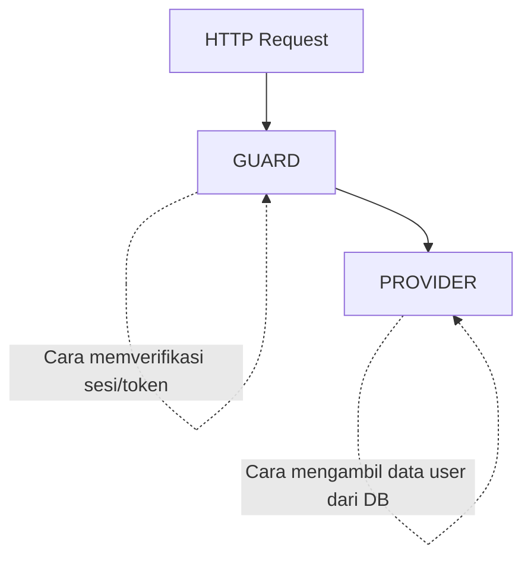

**Autentikasi** adalah proses memverifikasi identitas pengguna (apakah kredensial email & password yang dimasukkan valid). Setelah pengguna terautentikasi, sistem akan menentukan hak akses pengguna melalui proses **Otorisasi**.

Laravel menyediakan ekosistem autentikasi yang sangat fleksibel, aman, dan siap pakai untuk berbagai arsitektur aplikasi (Monolith SSR, Single Page Application, maupun Mobile API).

---

## 1. Konsep Inti: Guards & Providers

Di balik layar, sistem autentikasi Laravel digerakkan oleh dua komponen utama yang dikonfigurasi di `config/auth.php`:



- **Guards:** Menentukan bagaimana pengguna diautentikasi pada setiap permintaan.
  - Guard `web`: Menyimpan status login menggunakan Session dan Cookie browser.
  - Guard `sanctum` / `api`: Memvalidasi pengguna melalui Token Bearer pada HTTP Header.
- **Providers:** Menentukan dari mana data pengguna diambil (biasanya menggunakan Eloquent Model `App\Models\User`).

---

## 2. Pilihan Paket Autentikasi Resmi Laravel

Laravel menyediakan paket siap pakai (*Starter Kits*) sesuai arsitektur frontend yang Anda pilih:

::card-group
::card{title="Laravel Breeze" icon="lucide:zap"}
Starter kit sederhana, minimalis, dan sangat mudah dikustomisasi. Mendukung template Blade, Inertia (Vue/React), atau mode API murni.
::
::card{title="Laravel Fortify" icon="lucide:server"}
Backend autentikasi *headless* tanpa UI bawaan. Sangat ideal jika Anda membangun frontend terpisah (misalnya menggunakan Nuxt atau Next.js).
::
::card{title="Laravel Sanctum" icon="lucide:key"}
Sistem autentikasi ringan untuk SPA (*Single Page Application*), aplikasi mobile Flutter/React Native, dan RESTful API berbasis token.
::
::card{title="Laravel Socialite" icon="lucide:globe"}
Memungkinkan login pihak ketiga (*OAuth*) secara mudah menggunakan akun Google, GitHub, Facebook, Twitter, dan Apple.
::
::

---

## 3. Instalasi Cepat dengan Laravel Breeze

Untuk memasang sistem autentikasi lengkap (Login, Registrasi, Lupa Password, Reset Password, Verifikasi Email) berbasis Blade dan Tailwind CSS:

::steps
### 1. Pasang Package Laravel Breeze
```bash [Terminal]
composer require laravel/breeze --dev
```

### 2. Jalankan Perintah Instalasi Breeze
```bash [Terminal]
php artisan breeze:install blade
```

### 3. Migrasi Database & Kompilasi Aset
```bash [Terminal]
php artisan migrate
npm install && npm run build
```
::

Setelah langkah di atas selesai, Anda dapat langsung mengakses halaman login di browser pada alamat `http://127.0.0.1:8000/login`.

---

## 4. Memproteksi Rute dengan Middleware

Gunakan middleware `auth` untuk membatasi akses halaman hanya untuk pengguna yang telah login:

::tabs
::tabs-item{label="Web Routes (Session Auth)"}
```php [routes/web.php]
use App\Http\Controllers\DashboardController;

// Rute ini hanya bisa diakses setelah login
Route::middleware(['auth'])->group(function () {
    Route::get('/dashboard', [DashboardController::class, 'index'])->name('dashboard');
    Route::get('/profile', [DashboardController::class, 'profile'])->name('profile');
});
```
::

::tabs-item{label="API Routes (Sanctum Token Auth)"}
```php [routes/api.php]
use Illuminate\Http\Request;
use Illuminate\Support\Facades\Route;

// Endpoint API yang dilindungi token Sanctum
Route::middleware('auth:sanctum')->get('/user', function (Request $request) {
    return response()->json($request->user());
});
```
::
::

---

## 5. Mengakses Data Pengguna yang Sedang Login

Laravel menyediakan helper praktis untuk mendapatkan objek user yang sedang aktif:

```php [Controller / Route]
use Illuminate\Support\Facades\Auth;

// 1. Mengambil objek model pengguna yang sedang login
$user = Auth::user(); // atau: auth()->user();

// 2. Mengambil ID pengguna yang sedang login secara langsung
$userId = Auth::id();

// 3. Memeriksa apakah pengguna sudah login (mengembalikan boolean true/false)
if (Auth::check()) {
    // Pengguna sudah login
}
```

### Menyesuaikan Tampilan di Template Blade

Gunakan directive `@auth` dan `@guest` untuk menampilkan elemen UI secara kondisional:

```blade [resources/views/navbar.blade.php]
<nav class="flex items-center justify-between p-4 bg-white shadow-sm">
    <a href="/" class="font-bold text-lg">MyApplication</a>

    <div class="space-x-4">
        @auth
            <!-- Tampil hanya jika pengguna SUDAH login -->
            <span>Halo, <strong>{{ auth()->user()->name }}</strong></span>
            <a href="{{ route('dashboard') }}">Dashboard</a>
            
            <form action="{{ route('logout') }}" method="POST" class="inline">
                @csrf
                <button type="submit" class="text-red-500">Keluar</button>
            </form>
        @endauth

        @guest
            <!-- Tampil hanya jika pengguna BELUM login -->
            <a href="{{ route('login') }}" class="btn-primary">Masuk</a>
            <a href="{{ route('register') }}" class="btn-secondary">Daftar</a>
        @endguest
    </div>
</nav>
```
