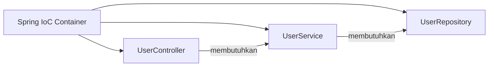
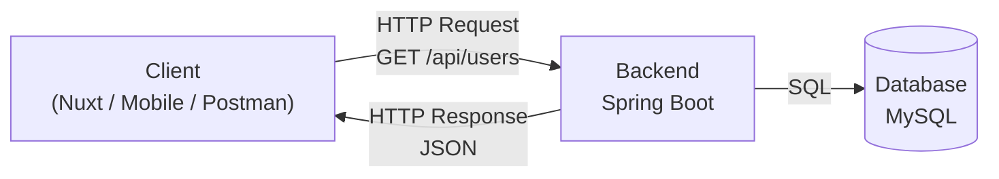
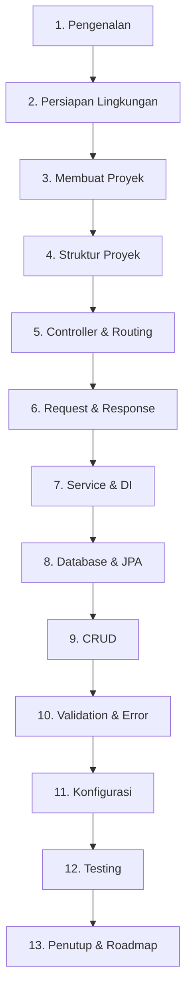

**Spring Boot** adalah framework backend Java modern yang memungkinkan kita membangun REST API dan aplikasi web siap produksi dengan konfigurasi minimal. Ia dibangun di atas **Spring Framework** dan menjadi salah satu standar de facto pengembangan backend enterprise di dunia Java.

::alert{type="info" icon="lucide:info"}
Dokumentasi ini mengadopsi standar modern **Spring Boot 4.1.x** yang berjalan di atas **Spring Framework 7** dan ekosistem **Jakarta EE 11** — dengan dukungan Java 17 hingga Java 26, Maven Wrapper, serta konvensi kode Java 21+ (record, var, text block). Semua contoh ditulis mengikuti praktik terbaik resmi dari [docs.spring.io](https://docs.spring.io/spring-boot/reference/).
::

---

## 1. Posisi Java Saat Ini

Sebelum menyentuh Spring Boot, ada baiknya kita luruskan dulu persepsinya: **Java bukan bahasa "jadul"**.

Sejak rilis **Java 17 (LTS)** dan **Java 21 (LTS)**, bahasa ini mengalami modernisasi besar-besaran. Fitur-fitur yang dulu hanya dimiliki bahasa-bahasa "kekinian" kini tersedia secara native:

| Fitur Modern | Java | Analogi Sederhana |
| :--- | :--- | :--- |
| **Record** (data class) | 16+ | Seperti data class di Kotlin/TypeScript |
| **var** (local type inference) | 10+ | Seperti `auto` di C++ atau `val` di Kotlin |
| **Text Block** (`"""..."""`) | 15+ | Template string multiline |
| **Switch Expression** (`->`) | 14+ | Switch yang mengembalikan nilai |
| **Virtual Threads** (concurrency ringan) | 21 | Model async ala Go goroutine |
| **Sealed Class** | 17 | Hierarki class yang terkontrol |

::tip
Dalam modul ini kita akan **aktif memakai** fitur-fitur modern tersebut, bukan sekadar mengetahui namanya. Konsep lama seperti *boilerplate getter/setter* akan kita ganti dengan **record** — persis seperti semangat PHP modern yang meninggalkan Laragon dan beralih ke tooling native.
::

---

## 2. Apa Itu Spring?

**Spring** adalah ekosistem framework untuk membangun aplikasi Java. Inti dari Spring adalah dua konsep kunci:

### Inversion of Control (IoC)

Alih-alih kita membuat dan menghubungkan objek satu sama lain secara manual, **Spring yang mengurus**. Kita cukup "mendaftarkan" komponen, dan Spring menyusun hubungan antar-komponen tersebut.

### Dependency Injection (DI)

Konsekuensi dari IoC: jika sebuah class membutuhkan class lain (misalnya Controller membutuhkan Service), **Spring yang menyuntikkan** (inject) dependency-nya — bukan kita yang memanggil `new` di sana-sini.



---

## 3. Spring Framework vs Spring Boot

Dua istilah ini sering membingungkan pemula. Perbedaannya sederhana:

::card-group
::card{title="Spring Framework" icon="lucide:layers"}
**Fondasinya.** Menyediakan Spring MVC, Dependency Injection, Transaction Management, Data Access, dan puluhan modul lain. Sangat powerful, tetapi butuh konfigurasi manual yang banyak.
::

::card{title="Spring Boot" icon="lucide:rocket"}
**Percepatnya.** Berjalan di atas Spring Framework dan menyediakan *auto-configuration*, *starter dependencies*, serta *embedded server* sehingga kita bisa fokus menulis logika bisnis, bukan konfigurasi.
::
::

Analogi sederhananya: kalau Spring Framework itu adalah **rangkaian komponen elektronik**, maka Spring Boot adalah **perangkat siap pakai** yang sudah dirangkai dan diuji pabrik.

### Fitur Inti Spring Boot

| Fitur | Fungsi |
| :--- | :--- |
| **Auto-Configuration** | Spring Boot mendeteksi dependency di classpath lalu menyiapkan konfigurasi yang sesuai secara otomatis |
| **Starter Dependencies** | Satu koordinat Maven yang membawa sekumpulan library yang kompatibel satu sama lain |
| **Embedded Server** | Tomcat bawaan — aplikasi dijalankan sebagai Java biasa (`java -jar`), tanpa install server terpisah |
| **Production-ready** | Actuator untuk monitoring, metrics, dan health check |
| **Opinionated Defaults** | Semua konfigurasi punya nilai default yang masuk akal, tinggal ditimpa bila perlu |

---

## 4. Mengapa Belajar Spring Boot di 2026?

::card-group
::card{title="Standar Industri" icon="lucide:building-2"}
Bank, e-commerce, dan startup besar masih mengandalkan Java + Spring untuk sistem backend mereka. Permintaan developer-nya konsisten tinggi di seluruh dunia.
::

::card{title="Ekosistem Matang" icon="lucide:package"}
Dukungan penuh untuk Docker, Kubernetes, observability (Micrometer/OpenTelemetry), hingga serverless dan GraalVM native image.
::

::card{title="Mengikuti Java Modern" icon="lucide:code-2"}
Spring Boot 4.x dirancang untuk Java 17-26, mendukung virtual threads, dan mengadopsi standar Jakarta EE terbaru.
::

::card{title="Backend untuk Frontend" icon="lucide:plug"}
REST API yang dibuat dengan Spring Boot dapat dikonsumsi oleh frontend apa pun — Nuxt, Next.js, Flutter, maupun aplikasi mobile.
::
::

---

## 5. Apa Itu REST API?

**REST API** adalah API yang menggunakan protokol HTTP sebagai media komunikasi antara client dan server. Client bisa berupa browser, aplikasi mobile, atau frontend framework seperti Nuxt.



Contoh response JSON dari REST API:

```json
[
  {
    "id": 1,
    "name": "Rehan",
    "email": "rehan@example.com"
  }
]
```

Karena formatnya JSON, frontend apa pun bisa mengonsumsi data ini tanpa perlu tahu detail teknologi backend-nya.

---

## 6. Jakarta EE: Kenapa Bukan `javax` Lagi?

Ini penting: kita mungkin menemukan tutorial lama yang menulis import seperti ini:

```java
import javax.persistence.Entity;   // ❌ LAMA — tutorial pra-2022
```

Sejak Java EE diserahkan ke Eclipse Foundation dan berganti nama menjadi **Jakarta EE**, seluruh namespace berubah dari `javax` menjadi `jakarta`:

```java
import jakarta.persistence.Entity;  // ✅ MODERN — Jakarta EE 9+
```

Spring Boot 4.x sepenuhnya menggunakan namespace `jakarta`. Kalau nanti teman kita menyalin kode dari tutorial lama dan muncul error `package javax.persistence does not exist`, itu penyebabnya.

::warning
Tutorial yang masih memakai `javax.persistence`, `javax.validation`, atau Spring Boot 2.x/3.x secara umum sudah usang. Selalu periksa tanggal dan versi tutorial yang kita ikuti.
::

---

## 7. Stack Teknologi yang Akan Kita Gunakan

| Teknologi | Versi | Peran |
| :--- | :--- | :--- |
| **Java (JDK)** | 17 min, disarankan 21 LTS | Bahasa pemrograman |
| **Spring Boot** | 4.1.x | Framework utama |
| **Spring Web** | (dari starter) | REST API & HTTP handling |
| **Spring Data JPA** | (dari starter) | Akses data |
| **Hibernate ORM** | 7.x | Implementasi JPA |
| **MySQL** | 8.x | Database (via Docker) |
| **Maven** | 3.6.3+ (via Wrapper) | Build tool |
| **JUnit 5 + MockMvc** | (dari starter) | Testing |

::alert{type="info" icon="lucide:calendar"}
Versi-versi di atas sesuai dengan rilis stabil terkini per akhir 2026: Spring Boot **4.1.1** (rilis 20 Agustus 2026), Java **26** (rilis Maret 2026), dengan Java **21 LTS** sebagai pilihan paling aman untuk produksi.
::

---

## 8. Roadmap Pembelajaran

Materi disusun bertahap mengikuti alur membangun satu REST API utuh — dari instalasi hingga testing:



Setiap bab mengembangkan **satu proyek yang sama** secara bertahap, sehingga konsep yang dipelajari langsung terimplementasi.

---

## 9. Untuk Siapa Materi Ini?

- Pemula yang sudah paham dasar Java (variabel, method, class) dan ingin masuk dunia backend
- Developer PHP/JavaScript yang ingin menambah skill backend enterprise
- Mahasiswa yang ingin membangun proyek dengan standar industri

::tip
Tidak perlu menguasai Java tingkat lanjut dulu. Setiap konsep Java modern yang kita pakai (record, var, text block) akan dijelaskan pada saat pertama kali muncul.
::

## Langkah Selanjutnya

Kalau sudah siap, lanjut ke [Persiapan Lingkungan Pengembangan](/spring-boot/persiapan-lingkungan) untuk menyiapkan JDK, editor, dan Docker di komputermu.
