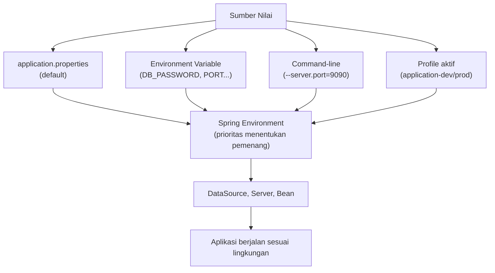

Aplikasi kita sudah punya banyak kemampuan — tapi coba perhatikan satu kelemahan: password database tertulis langsung di `application.properties` yang akan ikut ter-commit ke Git. Dan bagaimana aplikasi berjalan di server production, yang databasenya jelas bukan `localhost`?

Di sinilah **konfigurasi berbasis environment** bekerja.

---

## 1. Apa Itu Konfigurasi?

**Konfigurasi** adalah semua nilai yang menentukan *cara aplikasi berjalan* tanpa mengubah kode:

```properties
server.port=8080                                    ← port HTTP
spring.datasource.url=jdbc:mysql://...              ← alamat database
spring.jpa.hibernate.ddl-auto=update                ← perilaku schema
```

Prinsip dasarnya:

```text
Kode aplikasi      → logika (jarang berubah antar environment)
Konfigurasi        → nilai   (sering berubah antar environment)
```

Kalau database pindah alamat, yang berubah adalah **konfigurasi** — bukan satu baris Java pun.

---

## 2. Sumber Konfigurasi Spring Boot

Spring Boot membaca konfigurasi dari banyak sumber dengan **urutan prioritas**. Yang paling praktis dipahami:

```text
prioritas rendah
─────────────────────────────────────────────
application.properties              (file bawaan proyek)
environment variable                (dari sistem/terminal)
command-line argument               (--server.port=9090)
─────────────────────────────────────────────
prioritas tinggi
```

Artinya: nilai yang sama bisa punya **default di file**, lalu **ditimpa** lewat environment variable atau argument — tanpa mengedit file apa pun.

---

## 3. Environment Variable dan Placeholder `${...}`

### Pola default value

```properties
spring.datasource.password=${DB_PASSWORD:rahasia}
```

Cara membacanya:

```text
DB_PASSWORD ada?    → pakai nilai DB_PASSWORD
DB_PASSWORD tidak?  → pakai "rahasia" (default)
```

Sintaks `${NAMA:default}` inilah kunci memisahkan secret dari kode.

### Terapkan ke proyek kita

### Ganti seluruh isi `application.properties`

```properties
spring.application.name=belajar-spring-boot

spring.datasource.url=${DB_URL:jdbc:mysql://localhost:3306/belajar_spring_boot}
spring.datasource.username=${DB_USERNAME:root}
spring.datasource.password=${DB_PASSWORD:rahasia}

spring.jpa.hibernate.ddl-auto=${DDL_AUTO:update}
spring.jpa.show-sql=${SHOW_SQL:true}

server.port=${PORT:8080}

app.name=Belajar Spring Boot
```

Hasilnya: proyek tetap **jalan tanpa set variabel apa pun** (semua pakai default lokal), tetapi di server production cukup set `DB_URL`, `DB_PASSWORD`, dan `DDL_AUTO=none` sebagai environment variable — tanpa menyentuh file ini.

::tip
Perhatikan `DDL_AUTO` ikut jadi variabel: di development `update` itu praktis, di production `update` itu bahaya. Satu file, dua perilaku, sesuai environment.
::

---

## 4. Memberi Environment Variable

::tabs
::tabs-item{label="PowerShell (Windows)"}
```powershell
$env:DB_PASSWORD = "password-asli-ku"
.\mvnw.cmd spring-boot:run
```

Berlaku hanya untuk sesi terminal itu.
::

::tabs-item{label="Bash (macOS/Linux)"}
```bash
DB_PASSWORD=password-asli-ku ./mvnw spring-boot:run
```

Format `VAR=nilai perintah` — hanya berlaku untuk perintah itu saja. Paling rapi untuk sekali jalan.
::

::tabs-item{label="Command-line argument"}
```bash
./mvnw spring-boot:run -Dspring-boot.run.arguments=--server.port=9090
```

Cocok untuk eksperimen cepat ("coba port lain tanpa edit file").
::
::

Verifikasi: buka `http://localhost:9090/api/hello` → aplikasi hidup di port baru.

---

## 5. Membaca Konfigurasi di Kode: `@Value`

Custom property yang kita tambahkan:

```properties
app.name=Belajar Spring Boot
```

bisa dibaca di kode lewat annotation `@Value`:

### Ganti seluruh isi `service/HelloService.java`

```java
package com.example.belajarspringboot.service;

import org.springframework.beans.factory.annotation.Value;
import org.springframework.stereotype.Service;

@Service
public class HelloService {

    @Value("${app.name}")
    private String appName;

    public String getMessage() {
        return "Halo dari " + appName;
    }

}
```

Jalankan, buka `http://localhost:8080/api/hello`:

```text
Halo dari Belajar Spring Boot
```

Ubah `app.name` di properties → restart → pesan berubah. **Konfigurasi mengalir ke dalam kode tanpa di-hardcode.**

::alert{type="info" icon="lucide:info"}
`@Value` ideal untuk satu-dua property. Untuk kelompok konfigurasi yang kompleks (misalnya sepuluh properti terkait pembayaran), Spring Boot menyediakan `@ConfigurationProperties` — type-safe dan terkumpul dalam satu class. Layak dipelajari setelah modul ini; sementara `@Value` cukup untuk memahami mekanismenya.
::

---

## 6. Spring Profiles: Konfigurasi per Lingkungan

Environment variable menyelesaikan **nilai**, tetapi kadang kita ingin **kumpulan konfigurasi berbeda utuh per lingkungan**. Solusinya **profiles**.

### Buat file baru

```text
src/main/resources/application-dev.properties
```

```properties
spring.jpa.show-sql=true
spring.jpa.hibernate.ddl-auto=update
```

### Buat file baru

```text
src/main/resources/application-prod.properties
```

```properties
spring.jpa.show-sql=false
spring.jpa.hibernate.ddl-auto=none
```

File `application-{profile}.properties` hanya aktif saat profile tsb. dipilih. Pilihannya:

```bash
# jalankan dengan profile dev
./mvnw spring-boot:run -Dspring-boot.run.profiles=dev

# jalankan dengan profile prod
./mvnw spring-boot:run -Dspring-boot.run.profiles=prod
```

Atau lewat environment variable yang jadi standar deployment: `SPRING_PROFILES_ACTIVE=prod`.

Pola pemakaiannya:

```text
application.properties            → nilai umum + default (shared)
application-dev.properties        → khusus development (debug, ddl-auto=update)
application-prod.properties       → khusus production (senyap, ddl-auto=none)
```

::alert{type="warning" icon="lucide:alert-triangle"}
Kaidah utama secret: **password asli tidak pernah di-commit**. Di development, default lokal boleh (mis. `rahasia` untuk container Docker kita). Di production, password **wajib** datang dari environment variable/secret manager — bukan dari file di Git. Setelah bab ini, biasakan bedakan: konfigurasi biasa boleh di file, credential lewat environment.
::

---

## 7. Bonus Modern: Docker Compose untuk Production-ish

Sama seperti aplikasinya, konfigurasi Docker juga bisa dipisah per lingkungan. File `docker-compose.yml` kita saat ini bagus untuk development. Untuk merasakan pola modernnya, override bisa dibuat tanpa file kedua:

```bash
# development: seperti biasa
docker compose up -d

# mengubah password via environment tanpa edit file
MYSQL_ROOT_PASSWORD=password-lain docker compose up -d
```

::tip
Di proyek sungguhan, pola umumnya `docker-compose.yml` (base) + `docker-compose.prod.yml` (override) atau langsung ke Kubernetes. Intinya sama dengan profiles: **base umum, lingkungan menimpa**. Ini konsep yang sama persis — layak diingat ketika nanti belajar deployment.
::

---

## 8. Konfigurasi Kita Sekarang



---

## 9. Masalah Umum

::tabs
::tabs-item{label="Placeholder tidak tergantikan"}
`${DB_PASSWORD}` **tanpa default** dan variabelnya tidak ada → aplikasi gagal start dengan `Could not resolve placeholder`. Solusi: beri default `${DB_PASSWORD:...}` atau set variabelnya.
::

::tabs-item{label="Nama variabel salah"}
`${DB_PASSWORD:...}` mencari variabel bernama **tepat** `DB_PASSWORD` — `DATABASE_PASSWORD` tidak dicocokkan otomatis. Nama harus identik.
::

::tabs-item{label="Perubahan konfigurasi tidak terasa"}
Konfigurasi dibaca **saat start**. Ubah file → restart aplikasi. Tidak ada hot-reload untuk properties (kecuali tool khusus di luar cakupan modul).
::

::tabs-item{label="Profile tidak aktif"}
`application-dev.properties` tidak dibaca → profile belum dipilih. Cek log start: Spring Boot selalu mencetak baris `The following 1 profile is active: "dev"`.
::
::

---

## 10. Checklist

- [ ] `application.properties` memakai pola `${VAR:default}`
- [ ] Aplikasi tetap jalan tanpa set environment variable apa pun
- [ ] Berhasil override `PORT` lewat environment variable / command line
- [ ] Custom property `app.name` dibaca lewat `@Value`
- [ ] `application-dev.properties` dan `application-prod.properties` dibuat
- [ ] Berhasil menjalankan dengan profile `dev` dan `prod`
- [ ] Pahami urutan prioritas sumber konfigurasi
- [ ] Pahami kaidah: credential lewat environment, bukan di-commit

## Ringkasan

```text
application.properties   → default aman untuk semua orang
${VAR:default}           → placeholder dengan default
environment variable     → menimpa default, tempat credential
profiles                 → kumpulan konfigurasi per lingkungan
@Value                   → menyuntikkan konfigurasi ke bean

Hasil: satu set kode, banyak environment, tanpa mengubah kode.
```

Aplikasi kini siap "dipindah-pindah". Fondasi terakhir yang tersisa: memastikan semua perilaku di atas **teruji otomatis**.

## Selanjutnya

Lanjut ke [Testing Dasar](/spring-boot/testing-dasar).
