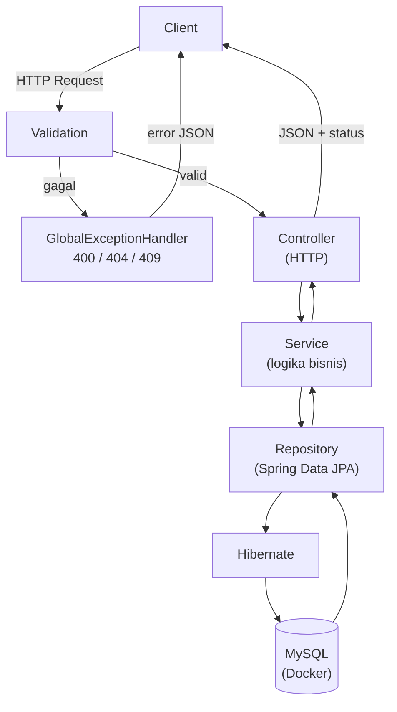

Perjalanan modul ini resmi selesai. Kita mulai dari nol — folder kosong — dan berakhir dengan **REST API yang teruji otomatis**, terhubung database, tervalidasi, dan siap dipindah-pindah environment. Bab ini merangkum semuanya lalu membuka pintu ke berikutnya.

---

## 1. Perjalanan Kita dalam Satu Halaman

```text
Bab 1-2   Konsep + lingkungan     → JDK 21, Docker, tanpa Maven global
Bab 3     Proyek pertama          → Spring Initializr + Maven Wrapper
Bab 4     Struktur                → package layer, root package
Bab 5     Controller              → endpoint HTTP pertama
Bab 6     Request & Response      → record, @RequestParam, @PathVariable
Bab 7     Service & DI            → logika bisnis + constructor injection
Bab 8     Database & JPA          → Docker Compose + Entity + Hibernate
Bab 9     CRUD                    → Repository, 201/204, query method
Bab 10    Validation & Error      → @Valid, exception global, 400/404/409
Bab 11    Konfigurasi             → ${VAR:default}, profiles
Bab 12    Testing                 → JUnit 5, MockMvc, integration test
```

Dan proyek yang kita bangun tumbuh bertahap:

```text
Bab 3:  BelajarSpringBootApplication saja
Bab 5:  + HelloController
Bab 6:  + HelloResponse (record)
Bab 7:  + HelloService
Bab 8:  + User entity + MySQL via Docker
Bab 9:  + UserRepository + UserService + UserController
Bab 10: + ResourceNotFoundException + GlobalExceptionHandler
Bab 12: + 4 automated tests
```

Setiap file selalu lahir **ketika dibutuhkan** — tidak ada yang muncul "sekadar biar lengkap".

---

## 2. Gambaran Utuh Aplikasi Akhir



Satu alur, semua konsep bertemu: HTTP masuk, tervalidasi, diproses logika bisnis, tersimpan via ORM, dan kembali sebagai JSON — dengan error terstruktur bila ada masalah.

---

## 3. Rangkuman Konsep Kunci

::tabs
::tabs-item{label="Arsitektur"}
```text
Controller  → HTTP saja (mapping, parameter, response)
Service     → logika bisnis saja
Repository  → akses data saja
Entity      → pemetaan tabel
Exception   → error global di satu tempat

Arah alur satu arah ke bawah — tidak pernah kebalik.
```
::

::tabs-item{label="Spring & DI"}
```text
IoC Container        → Spring membuat & mengelola objek (bean)
Bean                 → objek milik Spring (singleton default)
Constructor injection→ dependency via constructor, field final,
                       tanpa @Autowired (satu constructor)
Component scanning   → menemukan bean dari root package ke bawah
```
::

::tabs-item{label="Data"}
```text
JPA              → spesifikasi (kontrak)
Hibernate        → implementasinya
Spring Data JPA  → repository tanpa implementasi
Query method     → query dibuat dari nama method
ddl-auto=update  → hanya development; production = Flyway
```
::

::tabs-item{label="Web & Kualitas"}
```text
@Valid + annotation  → input dijaga di pintu (400)
@RestControllerAdvice → error global (400/404/409)
Status code benar     → 201 Create, 204 Delete
${VAR:default}        → konfigurasi antar environment
MockMvc + JUnit 5     → perilaku terjaga otomatis
```
::
::

---

## 4. Fitur Java Modern yang Kita Pakai

Modul ini sengaja menulis kode dengan **standar Java 2026**, bukan gaya tutorial 2018:

| Fitur | Kita pakai di |
| :--- | :--- |
| **record** — DTO satu baris, immutable | Bab 6 (`HelloResponse`) |
| **Text block** `"""..."""` — JSON di test | Bab 12 |
| **jakarta.\*** — namespace Jakarta EE modern | Bab 8, 10 |
| **Maven Wrapper** — tooling ikut proyek | Bab 2, 3 |
| **Docker Compose** — infrastruktur sebagai kode | Bab 8 |
| **var** (opsional) — type inference lokal | Kapan pun cocok |

Kalau kode kita dibandingkan dengan tutorial lama, perbedaannya terasa langsung: lebih sedikit boilerplate, lebih banyak intent.

---

## 5. Checklist Akhir: Bisa Dijelaskan dengan Kata Sendiri?

Ukuran pemahaman terbaik bukan "pernah membaca", melainkan **bisa menjelaskan**. Uji diri:

- [ ] Apa bedanya Spring Framework, Spring Boot, dan Spring Data JPA?
- [ ] Mengapa main class harus di root package?
- [ ] Apa itu bean, dan mengapa kita tidak pernah `new` untuk bean?
- [ ] Kenapa constructor injection + field `final`?
- [ ] JPA vs Hibernate vs Spring Data JPA — mana spesifikasi, mana implementasi?
- [ ] Mengapa `Optional` untuk `findById`, dan apa fungsi `orElseThrow`?
- [ ] Kenapa POST → 201 dan DELETE → 204?
- [ ] Apa urutan alur validation gagal → siapa yang merespons → status berapa?
- [ ] Kenapa `${DB_PASSWORD:...}` lebih aman daripada password tertulis?
- [ ] Apa yang diuji `contextLoads`, dan apa beda unit vs integration test?

Kalau ada yang macet, **itu menemukan bab yang perlu diulang** — bukan tanda gagal.

---

## 6. Yang Belum Kita Pelajari (Roadmap)

Modul ini sengaja berhenti di fondasi agar kokoh. Berikut peta lanjutan yang tersusun logis:

::steps
### 1. DTO & Mapping
Pisahkan request/response dari Entity (`UserRequest`, `UserResponse` + MapStruct). Mencegah over-posting dan membongkar ketergantungan API ke schema database.

### 2. Database Migration: Flyway
Gantikan `ddl-auto=update` dengan script migrasi berversi — standar mutlak proyek serius. Skema berubah terkontrol, bisa di-rollback, teruji di CI.

### 3. Security: Spring Security + JWT
Autentikasi (login) dan otorisasi (siapa boleh apa). Password hashing BCrypt, endpoint terproteksi, role-based access.

### 4. Testing Lanjutan: Testcontainers & Mockito
Database test yang selalu bersih dan terisolasi; unit test dengan mock untuk Service.

### 5. Observability: Actuator + Micrometer
Health check, metrics, dan info aplikasi siap dipantau — bawaan Spring Boot yang sering dilupakan pemula.

### 6. Deployment: Dockerfile & Cloud
Bungkus aplikasi menjadi image (`java -jar` di container ringan), deploy ke cloud. Kombinasikan dengan GitHub Actions untuk CI/CD otomatis.

### 7. Topik Lanjutan Lainnya
Pagination & sorting (`Pageable`), caching, scheduled jobs, message queue (Kafka/RabbitMQ), GraphQL/gRPC (ada di Spring Boot 4.1), dan GraalVM native image.
::

::tip
Urutan yang disarankan: **DTO → Flyway → Security**. Ketiganya menutup celah paling sering ditemui di proyek nyata.
::

---

## 7. Latihan Mandiri

Pemahaman menguat dengan **mengulang pola pada domain lain**. Buat `Product API` dari nol — tanpa melihat kode modul, hanya polanya:

| Latihan | Target |
| :--- | :--- |
| 1. Entity `Product` (name, price, stock) + tabel baru | Ulangi Bab 8 |
| 2. CRUD lengkap dengan 201/204 | Ulangi Bab 9 |
| 3. Validasi: name wajib, price positif (`@Positive`) | Ulangi Bab 10 |
| 4. Exception `InsufficientStockException` → 409 | Perluas Bab 10 |
| 5. Query method: `findByPriceBetween` | Ulangi Bab 9 |
| 6. Test: create valid (201), create invalid (400) | Ulangi Bab 12 |

Kalau keenamnya selesai tanpa menyalin, fondasi kalian sudah **milik sendiri**.

---

## 8. Referensi Resmi

Sumber utama yang mengikuti versi terbaru — buat penelusuran mandiri:

- [Spring Boot Reference](https://docs.spring.io/spring-boot/reference/) — dokumen resmi, selalu sinkron dengan versi
- [Spring Framework Reference](https://docs.spring.io/spring-framework/reference/)
- [Spring Data JPA Reference](https://docs.spring.io/spring-data/jpa/reference/)
- [Spring Initializr](https://start.spring.io/)
- [Spring Blog](https://spring.io/blog) — pengumuman rilis & fitur baru

::alert{type="info" icon="lucide:book-open"}
Kebiasaan yang membedakan developer senior: **membaca dokumentasi resmi lebih dulu**. Tutorial melatih langkah; dokumentasi menjelaskan alasannya.
::

---

## 9. Terima Kasih & Sampai Jumpa

```text
Yang kita bangun: REST API sederhana
Yang kita miliki sekarang: fondasi yang benar
Yang menentukan selanjutnya: kebiasaan melanjutkan
```

Modul ini selesai. Proyek kecil yang dibangun memang sederhana — dan memang itulah tujuannya: **alur yang dipahami total** lebih berharga daripada aplikasi besar yang hanya disalin.

Sampai jumpa di modul tingkat lanjut!

## Kembali

Kembali ke [daftar materi Spring Boot](/spring-boot).
