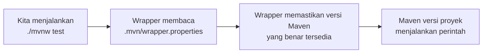

Sebelum menulis kode Spring Boot, kita siapkan dulu "dapurnya". Bab ini dirancang agar setiap alat terpasang **dengan cara yang direkomendasikan ekosistem modern** — bukan sekadar "asal jalan".

::alert{type="info" icon="lucide:info"}
Prinsip bab ini: **JDK via package manager, Maven lewat Wrapper, database lewat Docker.** Tidak perlu Laragon, tidak perlu XAMPP, dan tidak perlu install Maven secara global — pendekatan yang sama seperti dunia PHP modern yang meninggalkan bundle server all-in-one dan beralih ke tooling native.
::

---

## 1. Ringkasan Kebutuhan

| Komponen | Versi Minimum | Cara Modern Memasangnya |
| :--- | :--- | :--- |
| **JDK** | 17 (disarankan 21 LTS) | SDKMAN! / winget / Temurin installer |
| **Editor** | — | VS Code + Extension Pack, atau IntelliJ IDEA |
| **Docker Desktop** | 4.x | Unduh resmi (untuk database MySQL) |
| **Maven** | 3.6.3+ | **Tidak perlu dipasang** — datang via Maven Wrapper |
| **Git** | 2.x | winget / installer resmi |
| **API Client** | — | Postman, Insomnia, atau ekstensi REST Client (bab 5+) |

::tip
Java 21 adalah versi **LTS (Long Term Support)** terdekat, artinya mendapat pembaruan jangka panjang. Spring Boot 4.1 mendukung Java 17 s.d. Java 26, jadi kita memilih 21 LTS sebagai titik aman yang modern.
::

---

## 2. Memasang JDK (Cara Modern)

Ada dua pendekatan yang direkomendasikan — pilih sesuai sistem operasi.

::tabs
::tabs-item{label="1. SDKMAN! (macOS / Linux / WSL)"}
[SDKMAN!](https://sdkman.io) adalah package manager khusus SDK untuk sistem berbasis Unix. Keunggulannya: bisa memasang **beberapa versi JDK sekaligus** dan berpindah antar-versi dengan satu perintah.

```bash [Terminal]
# Pasang SDKMAN!
curl -s "https://get.sdkman.io" | bash
source "$HOME/.sdkman/bin/sdkman-init.sh"

# Lihat JDK yang tersedia
sdk list java

# Pasang Temurin 21 LTS
sdk install java 21.0.9-tem

# Jadikan default
sdk default java 21.0.9-tem
```

Verifikasi:

```bash
java -version
# openjdk version "21.0.9" ...
```
::

::tabs-item{label="2. winget (Windows)"}
Windows 10/11 modern menyertakan **winget** — package manager resmi Microsoft. Tidak perlu lagi "download installer dari google, next-next-finish":

```powershell [PowerShell]
# Cari JDK Temurin 21 yang tersedia
winget search EclipseAdoptium.Temurin.21

# Pasang
winget install EclipseAdoptium.Temurin.21.JDK
```

Setelah terpasang, buka ulang terminal lalu verifikasi:

```powershell
java -version
# openjdk version "21.0.9" ...
```

::alert{type="tip" icon="lucide:lightbulb"}
winget otomatis mendaftarkan JDK ke `PATH` dan mengatur `JAVA_HOME`. Kalau perintah `java` belum dikenali, buka ulang terminal — environment variable baru dimuat saat sesi baru.
::
::
::

::tabs
::tabs-item{label="3. Installer Resmi (Alternatif Manual)"}
Kalau memang lebih nyaman dengan installer grafis:

- **Eclipse Temurin** ([adoptium.net](https://adoptium.net)) — build OpenJDK paling populer, gratis, dan disarankan Spring
- **Oracle JDK** ([oracle.com/java](https://www.oracle.com/java/)) — resmi dari Oracle
- **Amazon Corretto** — build Amazon, gratis

Saat instalasi, centang opsi *"Set JAVA_HOME"* dan *"Add to PATH"* jika tersedia.
::

::tabs-item{label="4. Memeriksa Instalasi"}
Pastikan **kedua** perintah berikut berhasil:

```bash
java -version
# openjdk version "21.0.9" ...

javac -version
# javac 21.0.9
```

Yang dibutuhkan adalah **JDK** (ada compiler `javac`), bukan hanya JRE. Perbedaannya:

```text
JRE  → hanya bisa MENJALANKAN aplikasi Java
JDK  → bisa MENGEMBANGKAN (compile) dan menjalankan
```

::alert{type="warning" icon="lucide:alert-triangle"}
Kalau `java -version` berhasil tetapi `javac -version` tidak dikenali, besar kemungkinan yang terpasang adalah JRE. Pasang ulang sebagai JDK.
::
::
::

---

## 3. Kenapa Tidak Perlu Install Maven?

Ini pertanyaan yang paling sering muncul. Jawabannya: **Maven Wrapper**.

Setiap proyek yang kita buat nanti lewat Spring Initializr otomatis menyertakan:

```text
proyek-kita/
├── mvnw          ← Maven Wrapper (macOS/Linux)
├── mvnw.cmd      ← Maven Wrapper (Windows)
├── .mvn/
│   └── wrapper/
│       └── maven-wrapper.properties
└── pom.xml
```

Alur kerjanya:



Keunggulan besar bagi tim dan pemula:

::card-group
::card{title="Konsisten untuk Semua Orang" icon="lucide:users"}
Semua anggota tim memakai versi Maven yang **persis sama** — tidak ada lagi kasus "di komputer A jalan, di komputer B error".
::

::card{title="Zero Setup" icon="lucide:zap"}
Rekan satu tim baru cukup clone repo lalu langsung `./mvnw spring-boot:run`. Tidak perlu install Maven manual.
::

::card{title="CI/CD Friendly" icon="lucide:container"}
GitHub Actions, GitLab CI, dan Docker punya image Maven resmi — pipeline build tidak perlu konfigurasi ekstra.
::
::

Jadi di komputer kita cukup ada **JDK**. Maven akan "datang mengikuti proyek".

---

## 4. Docker untuk Database

Sejak bab database, kita membutuhkan MySQL. Cara modern menjalankannya bukan dengan installer MySQL biasa, melainkan **Docker**.

### Mengapa Docker?

| Masalah MySQL Installer | Solusi Docker |
| :--- | :--- |
| Versi MySQL berbeda antar anggota tim | Versi dikunci di `docker-compose.yml` |
| Mengotori sistem operasi | Berjalan terisolasi di container |
| Port & service tetap berjalan di background | Hidup-mati sesuai kebutuhan (`docker compose up/down`) |
| Sulit di-reset saat eksperimen | `docker compose down -v` = bersih total |

### Memasang Docker Desktop

- **Windows/macOS:** unduh dari [docker.com/products/docker-desktop](https://www.docker.com/products/docker-desktop/), lalu jalankan dan tunggu hingga statusnya *running* (ikon paus di system tray).
- **Linux:** ikuti [panduan resmi Docker Engine](https://docs.docker.com/engine/install/).

Verifikasi:

```bash
docker --version
# Docker version 27.x.x

docker compose version
# Docker Compose version v2.x.x
```

::alert{type="info" icon="lucide:info"}
Di Windows, Docker Desktop membutuhkan **WSL 2** aktif. Installer biasanya menawarkan mengaktifkannya otomatis. Kalau diminta restart, jalankan saja — itu normal.
::

Database baru benar-benar kita pakai pada **Bab 8**. Untuk sekarang cukup dipastikan Docker terpasang dan berjalan.

---

## 5. Editor: VS Code atau IntelliJ IDEA?

Keduanya sangat layak — pilih sesuai kenyamanan.

::tabs
::tabs-item{label="VS Code (Ringan & Gratis)"}
Instal [Visual Studio Code](https://code.visualstudio.com/) lalu pasang dua extension berikut:

| Extension | Fungsi |
| :--- | :--- |
| **Extension Pack for Java** (Microsoft) | Syntax highlighting, debugger, Maven integration, refactoring |
| **Spring Boot Extension Pack** (VMware) | Wizard pembuat proyek, navigasi endpoint, *live process* info |

Dengan dua paket ini, VS Code menjadi IDE Java yang layak — lengkap dengan IntelliSense dan debugger.
::

::tabs-item{label="IntelliJ IDEA (Paling Lengkap)"}
[IntelliJ IDEA Community Edition](https://www.jetbrains.com/idea/download/) gratis dan merupakan IDE Java paling matang: refactoring cerdas, dukungan Maven-native, debugger visual, dan integrasi Spring yang dalam (versi Ultimate).

Untuk modul fundamental ini, **Community Edition sudah lebih dari cukup**.
::
::

::tip
Perintah-perintah di seluruh modul ini akan selalu ditulis dalam bentuk terminal, sehingga **tidak ada materi yang bergantung pada IDE tertentu**. Kita bisa ganti editor kapan pun tanpa mengulang materi.
::

---

## 6. Git

Git bukan keharusan untuk menjalankan Spring Boot, tetapi sangat disarankan — kita akan sering "menyimpan titik aman" setiap selesai satu bab:

```text
Bab 3  → proyek dibuat          → git commit
Bab 5  → controller pertama     → git commit
Bab 9  → CRUD selesai           → git commit
Bab 12 → testing selesai        → git commit
```

Pasang via winget (Windows) atau package manager lain:

```powershell
winget install Git.Git
```

```bash
git --version
# git version 2.51.0
```

---

## 7. Checklist Lingkungan

Sebelum lanjut, pastikan semua ini lolos:

- [ ] `java -version` → Java 17 atau lebih baru (idealnya 21)
- [ ] `javac -version` → versi sama dengan java
- [ ] `docker --version` → Docker terpasang
- [ ] Docker Desktop berstatus *running*
- [ ] Editor + extension Java terpasang
- [ ] `git --version` → Git terpasang
- [ ] **Tidak** perlu MySQL terpasang manual
- [ ] **Tidak** perlu Maven global di sistem

## Ringkasan

Lingkungan yang kita bangun jauh lebih ramping dari pendekatan lama:

```text
Cara Lama (tidak dipakai)          Cara Modern (kita pakai)
─────────────────────────          ─────────────────────────
Laragon / XAMPP              →    Docker Desktop
Maven global + JAVA_HOME     →    Maven Wrapper per proyek
JDK dari Google search       →    SDKMAN! / winget
MySQL installer              →    docker-compose.yml
```

## Selanjutnya

Lanjut ke [Membuat Proyek Spring Boot](/spring-boot/membuat-proyek) — saatnya menulis kode pertama!
