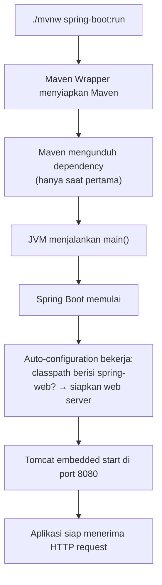

Lingkungan sudah siap. Sekarang kita buat **proyek utama modul** — satu proyek yang akan terus kita kembangkan dari bab ini sampai akhir, tanpa membuat ulang dari awal.

::alert{type="info" icon="lucide:info"}
Cara standar industri membuat proyek Spring Boot adalah melalui **Spring Initializr** ([start.spring.io](https://start.spring.io)) — generator resmi yang menyusun struktur proyek, `pom.xml`, dan dependency sesuai standar Spring. Praktik "buat folder sendiri lalu tulis pom.xml manual" sudah tidak digunakan.
::

---

## 1. Spring Initializr: Konfigurasi Proyek

Buka [https://start.spring.io](https://start.spring.io) dan isi seperti tabel berikut:

| Konfigurasi | Nilai | Penjelasan |
| :--- | :--- | :--- |
| **Project** | `Maven` | Build tool standar Spring (Gradle juga didukung, tapi kita konsisten pakai Maven) |
| **Language** | `Java` | Bahasa utama modul ini |
| **Spring Boot** | `4.1.1` | Versi stabil terkini — hindari versi `SNAPSHOT`/`M` untuk belajar |
| **Group** | `com.example` | "Alamat balik" organisasi. Format domain terbalik |
| **Artifact** | `belajar-spring-boot` | Nama proyek = nama folder = nama file JAR |
| **Name** | `belajar-spring-boot` | Nama tampilan proyek |
| **Package name** | `com.example.belajarspringboot` | Package Java utama, otomatis dari group + artifact |
| **Packaging** | `Jar` | Bisa dijalankan `java -jar` langsung (embedded server) |
| **Java** | `21` | Versi LTS yang kita pasang di bab sebelumnya |

::alert{type="warning" icon="lucide:alert-triangle"}
Kalau opsi **Java 21** tidak muncul, pastikan pilihan Spring Boot-nya 4.x. Initializr menyesuaikan daftar Java dengan versi Boot yang dipilih.
::

### Memilih Dependency

Tekan `Ctrl + B` (atau tombol **ADD DEPENDENCIES**) lalu cari dan tambahkan **satu** dependency:

```text
Spring Web
```

::tip
Kita sengaja **belum** menambahkan JPA, MySQL, atau Validation. Proyek akan dikembangkan bertahap — setiap dependency ditambahkan **pada bab saat ia dibutuhkan**, supaya kita selalu tahu dependency mana yang menghasilkan fitur mana. Inilah praktik yang juga dianjurkan ketika belajar, bukan "pasang semua dari awal lalu bingung sendiri".
::

Klik **GENERATE** → file ZIP terunduh → ekstrak ke folder proyek kita, misalnya:

```text
D:\project\belajar-spring-boot
```

---

## 2. Struktur Awal Hasil Generate

Setelah diekstrak, kita mendapat struktur siap pakai:

```text
belajar-spring-boot/
├── .mvn/                              ← konfigurasi Maven Wrapper
│   └── wrapper/
├── src/
│   ├── main/
│   │   ├── java/
│   │   │   └── com/example/belajarspringboot/
│   │   │       └── BelajarSpringBootApplication.java   ← entry point
│   │   └── resources/
│   │       └── application.properties                  ← konfigurasi aplikasi
│   └── test/
│       └── java/
│           └── com/example/belajarspringboot/
│               └── BelajarSpringBootApplicationTests.java
├── .gitignore
├── mvnw                               ← Maven Wrapper (Unix)
├── mvnw.cmd                           ← Maven Wrapper (Windows)
├── pom.xml                            ← definisi proyek & dependency
└── HELP.md                            ← info bantuan dari Initializr
```

Tidak perlu paham semuanya sekarang — bab berikutnya membongkar strukturnya satu per satu.

---

## 3. Menjalankan Aplikasi Pertama

Masuk ke folder proyek lalu jalankan lewat Maven Wrapper:

::tabs
::tabs-item{label="Windows (PowerShell)"}
```powershell
cd belajar-spring-boot
.\mvnw.cmd spring-boot:run
```
::

::tabs-item{label="macOS / Linux"}
```bash
cd belajar-spring-boot
./mvnw spring-boot:run
```
::
::

Saat **pertama kali** dijalankan, Maven akan mengunduh seluruh dependency ke folder cache lokal (`~/.m2`). Proses ini bisa memakan waktu beberapa menit tergantung koneksi — itu **normal**, dan hanya terjadi sekali (proses berikutnya jauh lebih cepat karena cache).

Jika berhasil, ujung log akan terlihat seperti ini:

```text
  .   ____          _            __ _ _
 /\\ / ___'_ __ _ _(_)_ __  __ _ \ \ \ \
( ( )\___ | '_ | '_| | '_ \/ _` | \ \ \ \
 \\/  ___)| |_)| | | | | || (_| |  ) ) ) )
  '  |____| .__|_| |_|_| |_\__, | / / / /
 =========|_|==============|___/=/_/_/_/

 :: Spring Boot ::                (v4.1.1)

...
Tomcat started on port 8080 (http) with context path '/'
Started BelajarSpringBootApplication in 2.312 seconds
```

::alert{type="success" icon="lucide:check"}
Perhatikan baris `Tomcat started on port 8080`. Artinya **embedded server** sudah aktif — kita tidak memasang Tomcat di mana pun, ia datang bersama Spring Boot.
::

### Mencoba di Browser

Buka `http://localhost:8080`. Kita akan melihat halaman error `Whitelabel Error Page` atau status `404`.

**Itu bukan kegagalan.** Bedakan dua hal ini:

```text
Aplikasi tidak berjalan   ≠   Endpoint tidak ditemukan
```

Aplikasi kita berjalan mulus — hanya saja kita **belum membuat endpoint sama sekali**, sehingga URL `/` belum punya penanganan. Controller pertama akan kita buat di [Bab 5](/spring-boot/controller-dan-routing).

### Menghentikan Aplikasi

```text
Ctrl + C
```

---

## 4. Apa yang Terjadi Saat `spring-boot:run` Dijalankan?



Kunci dari alur ini adalah **auto-configuration**: kita tidak pernah mengonfigurasi Tomcat, dispatcher, atau JSON mapper — Spring Boot mendeteksi `spring-boot-starter-web` di `pom.xml` lalu menyiapkan semuanya.

---

## 5. Isi `pom.xml` Saat Ini

```xml
<?xml version="1.0" encoding="UTF-8"?>
<project xmlns="http://maven.apache.org/POM/4.0.0"
         xmlns:xsi="http://www.w3.org/2001/XMLSchema-instance"
         xsi:schemaLocation="http://maven.apache.org/POM/4.0.0
         https://maven.apache.org/xsd/maven-4.0.0.xsd">

    <modelVersion>4.0.0</modelVersion>

    <parent>
        <groupId>org.springframework.boot</groupId>
        <artifactId>spring-boot-starter-parent</artifactId>
        <version>4.1.1</version>
        <relativePath/>
    </parent>

    <groupId>com.example</groupId>
    <artifactId>belajar-spring-boot</artifactId>
    <version>0.0.1-SNAPSHOT</version>
    <name>belajar-spring-boot</name>
    <description>Proyek pembelajaran Spring Boot</description>

    <properties>
        <java.version>21</java.version>
    </properties>

    <dependencies>
        <dependency>
            <groupId>org.springframework.boot</groupId>
            <artifactId>spring-boot-starter-web</artifactId>
        </dependency>

        <dependency>
            <groupId>org.springframework.boot</groupId>
            <artifactId>spring-boot-starter-test</artifactId>
            <scope>test</scope>
        </dependency>
    </dependencies>

    <build>
        <plugins>
            <plugin>
                <groupId>org.springframework.boot</groupId>
                <artifactId>spring-boot-maven-plugin</artifactId>
            </plugin>
        </plugins>
    </build>

</project>
```

Tiga bagian yang perlu dicermati:

| Bagian | Peran |
| :--- | :--- |
| `<parent>` | Mewarisi "bill of materials" Spring Boot — seluruh versi library sudah dipilihkan yang kompatibel. Kita jarang perlu menulis `<version>` untuk dependency Spring |
| `<dependencies>` | Starter yang kita pilih di Initializr |
| `<properties><java.version>` | Versi Java target compile |

::tip
Terima kasih mekanisme parent POM ini, menambah dependency nanti sesederhana menambah tiga baris — tanpa mengurus versinya. Persis semangat "konvensi di atas konfigurasi" milik Spring Boot.
::

---

## 6. Menjalankan dari IDE (Alternatif)

Selain terminal, entry point `BelajarSpringBootApplication.java` punya method `main` — artinya bisa dijalankan langsung dari tombol ▶ di IntelliJ atau VS Code.

```java
package com.example.belajarspringboot;

import org.springframework.boot.SpringApplication;
import org.springframework.boot.autoconfigure.SpringBootApplication;

@SpringBootApplication
public class BelajarSpringBootApplication {

    public static void main(String[] args) {
        SpringApplication.run(BelajarSpringBootApplication.class, args);
    }

}
```

::warning
Sebisa mungkin biasakan jalankan lewat **Maven Wrapper** saat belajar — perintahnya identik dengan yang dipakai CI/CD dan server produksi nanti. Tombol IDE enak, tapi membuat kita tidak menyentuh tooling yang sesungguhnya.
::

---

## 7. Masalah Umum Saat Startup Pertama

::tabs
::tabs-item{label="Port 8080 Sudah Dipakai"}
```text
Web server failed to start. Port 8080 was already in use.
```

Ada aplikasi lain (mungkin instance Spring Boot sebelumnya yang lupa di-stop) menempati port. Cari dan hentikan prosesnya:

```powershell
# Windows
netstat -ano | findstr :8080
taskkill /PID <nomor-pid> /F
```

```bash
# macOS / Linux
lsof -i :8080
kill <nomor-pid>
```

Cara mengubah port aplikasi akan dibahas di [Bab 11 — Konfigurasi](/spring-boot/konfigurasi-dan-lingkungan).
::

::tabs-item{label="JAVA_HOME is not set"}
Maven Wrapper butuh Java. Pastikan:

```bash
java -version
```

berhasil. Kalau tidak, kembali ke [Bab 2 — Persiapan Lingkungan](/spring-boot/persiapan-lingkungan).
::

::tabs-item{label="Dependency Gagal Diunduh"}
Biasanya koneksi atau proxy. Coba:

```bash
./mvnw clean spring-boot:run
```

Kalau tetap gagal, periksa koneksi internet dan pesan error Maven — jangan lanjut ke bab berikutnya dengan dependency yang setengah terunduh.
::

::tabs-item{label="`mvnw` tidak bisa dijalankan (Linux/macOS)"}
```bash
chmod +x mvnw
./mvnw spring-boot:run
```
::
::

---

## 8. Checklist

- [ ] Proyek dibuat lewat Spring Initializr dengan Spring Boot **4.1.1** dan Java **21**
- [ ] Dependency `Spring Web` sudah ada di `pom.xml`
- [ ] `./mvnw spring-boot:run` berhasil dijalankan
- [ ] Log menunjukkan `Tomcat started on port 8080`
- [ ] Memahami bahwa `404` di `http://localhost:8080` itu **normal** (belum ada endpoint)
- [ ] Aplikasi bisa dihentikan dengan `Ctrl + C` dan dijalankan ulang
- [ ] Tidak membuat file `Main.java` tambahan — entry point sudah disediakan

## Ringkasan

```text
Spring Initializr
      ↓
struktur proyek + pom.xml + Maven Wrapper
      ↓
./mvnw spring-boot:run
      ↓
auto-configuration mendeteksi spring-boot-starter-web
      ↓
Tomcat embedded berjalan di port 8080
      ↓
aplikasi siap menerima HTTP request
```

Proyek utama sudah hidup. Selanjutnya kita bedah isi foldernya agar setiap file punya alasan keberadaan.

## Selanjutnya

Lanjut ke [Mengenal Struktur Proyek](/spring-boot/struktur-proyek).
