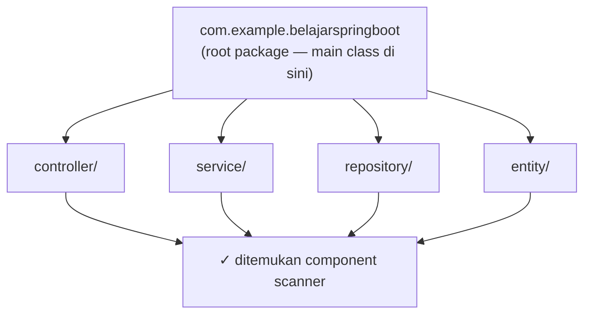
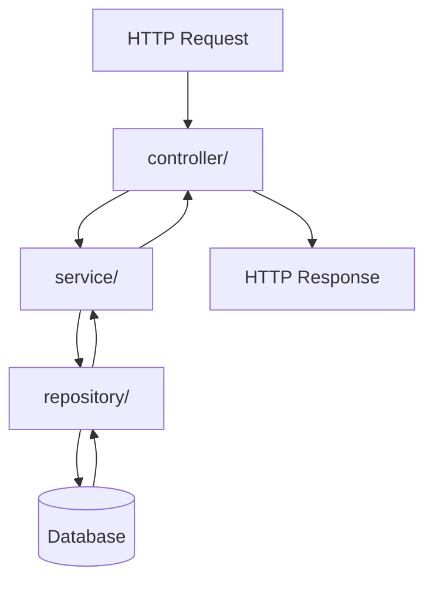

Proyek sudah berhasil dijalankan. Sekarang saatnya memahami **apa saja isi di dalamnya** — agar saat jumlah file bertambah di bab-bab berikutnya, kita tidak tersesat.

---

## 1. Peta Besar Proyek

```text
belajar-spring-boot/
├── .mvn/                     ← konfigurasi Maven Wrapper
├── src/
│   ├── main/                 ← kode aplikasi (yang dijalankan user)
│   │   ├── java/             ← semua file .java
│   │   └── resources/        ← konfigurasi & resource
│   └── test/                 ← kode pengujian
│       └── java/
├── .gitignore                ← file yang diabaikan Git
├── mvnw / mvnw.cmd           ← Maven Wrapper
├── pom.xml                   ← definisi proyek & dependency
└── HELP.md                   ← catatan bantuan dari Initializr
```

::tip
Prinsip terpenting: **kode aplikasi (`src/main`) dan kode pengujian (`src/test`) dipisah sejak awal.** Test tidak pernah dianggap bagian dari aplikasi yang dijalankan user.
::

---

## 2. `src/main/java` — Rumah Kode Java

```text
src/main/java/
└── com/
    └── example/
        └── belajarspringboot/
            └── BelajarSpringBootApplication.java
```

Perhatikan: struktur folder mengikuti **package Java**. Package:

```java
package com.example.belajarspringboot;
```

direpresentasikan sebagai folder `com/example/belajarspringboot/`. Ini aturan wajib Java — memindahkan file tanpa menyesuaikan package akan membuat kode gagal di-compile.

### Mengapa Main Class Harus di Root Package?

`@SpringBootApplication` sekaligus melakukan **component scanning**: mencari semua class ber-annotation Spring **mulai dari package main class ke bawah**.



Karena itu dokumentasi Spring Boot merekomendasikan main class berada di **root package**. Kalau main class kita letakkan terlalu dalam (misalnya di `com.example.belajarspringboot.config`), controller/service yang sejajar di atasnya **tidak akan pernah ditemukan** — error klasik pemula yang paling membingungkan.

::alert{type="warning" icon="lucide:alert-triangle"}
Aturan praktis: **semua kode aplikasi wajib berada di bawah** `com.example.belajarspringboot`. Membuat package di luar root (misal `com.example.controller`) = komponen tidak terdeteksi = `404` misterius.
::

### Jangan Pakai Default Package

Class tanpa deklarasi `package` (disebut *default package*) sebaiknya tidak pernah dipakai di proyek Spring Boot. Component scanning tidak dapat bekerja efektif, dan struktur proyek jadi tidak terbaca. Selalu gunakan package jelas seperti `com.example.belajarspringboot`.

---

## 3. `src/main/resources` — Rumus Konfigurasi

Saat ini isinya satu file:

```text
src/main/resources/
└── application.properties
```

File ini (masih kosong) adalah tempat konfigurasi aplikasi: port, database, dsb. Contoh yang akan kita pakai nanti:

```properties
server.port=8081
```

::warning
Untuk sekarang **biarkan kosong**. Konfigurasi database akan dibahas pada [Bab 8](/spring-boot/database-dan-jpa), dan konfigurasi environment secara menyeluruh di [Bab 11](/spring-boot/konfigurasi-dan-lingkungan).
::

---

## 4. `src/test/java` — Rumus Testing

```text
src/test/java/
└── com/example/belajarspringboot/
    └── BelajarSpringBootApplicationTests.java
```

Sudah ada satu file test bawaan dari Initializr. Kita baru menyentuhnya serius di [Bab 12 — Testing](/spring-boot/testing-dasar).

---

## 5. Struktur Package per Layer

Untuk proyek pembelajaran ini, kita menyusun kode berdasarkan **tanggung jawab (layer)**:

```text
com.example.belajarspringboot
│
├── BelajarSpringBootApplication.java   ← main class (root)
│
├── controller/     ← menangani HTTP request/response
├── service/        ← logika bisnis
├── repository/     ← akses data
├── entity/         ← representasi tabel database
└── exception/      ← penanganan error
```

| Package | Tanggung Jawab | Contoh File |
| :--- | :--- | :--- |
| `controller` | Menerima request, mengembalikan response | `UserController.java` |
| `service` | Aturan & logika bisnis | `UserService.java` |
| `repository` | Berkomunikasi dengan database | `UserRepository.java` |
| `entity` | Pemetaan Java ↔ tabel | `User.java` |
| `exception` | Custom exception & handler error | `ResourceNotFoundException.java` |

::alert{type="info" icon="lucide:info"}
Struktur *layer-based* ini adalah yang paling umum dijumpai di proyek Spring Boot dan paling mudah dipahami pemula. Alternatifnya adalah *feature-based* (paket per fitur: `user/`, `product/`) yang juga sah untuk proyek besar — Spring tidak mewajibkan salah satunya.
::

### Alur Antar Layer



Arah alur selalu **satu arah ke bawah**: Controller boleh memanggil Service, Service boleh memanggil Repository — tidak pernah sebaliknya. Repository tidak pernah tahu keberadaan Controller.

---

## 6. Proyek Ini Kelak Menjadi Seperti Ini

Setelah semua bab selesai, struktur lengkapnya:

```text
belajar-spring-boot/
├── .mvn/
├── src/
│   ├── main/
│   │   ├── java/com/example/belajarspringboot/
│   │   │   ├── BelajarSpringBootApplication.java
│   │   │   ├── controller/
│   │   │   │   ├── HelloController.java
│   │   │   │   └── UserController.java
│   │   │   ├── entity/
│   │   │   │   └── User.java
│   │   │   ├── exception/
│   │   │   │   ├── GlobalExceptionHandler.java
│   │   │   │   └── ResourceNotFoundException.java
│   │   │   ├── repository/
│   │   │   │   └── UserRepository.java
│   │   │   └── service/
│   │   │       ├── HelloService.java
│   │   │       └── UserService.java
│   │   └── resources/
│   │       └── application.properties
│   └── test/java/com/example/belajarspringboot/
│       └── BelajarSpringBootApplicationTests.java
├── mvnw / mvnw.cmd
└── pom.xml
```

::warning
**Jangan membuat folder-folder tersebut sekarang.** Setiap package akan kita buat pada bab ketika ia benar-benar dibutuhkan — supaya setiap folder selalu punya alasan keberadaan, bukan sekadar tampil rapi.
::

---

## 7. File-File di Root

| File | Fungsi | Perlu Diubah? |
| :--- | :--- | :--- |
| `pom.xml` | Definisi proyek, dependency, build | Ya — saat menambah dependency |
| `mvnw`, `mvnw.cmd` | Maven Wrapper | Tidak |
| `.mvn/` | Konfigurasi Wrapper | Tidak |
| `.gitignore` | Aturan abaikan file Git | Tidak (sudah bawaan Initializr) |
| `HELP.md` | Dokumentasi bantuan generate | Boleh dihapus, tidak berpengaruh |

---

## 8. Kesalahan Struktur yang Sering Terjadi

::tabs
::tabs-item{label="Main class terlalu dalam"}
```text
com.example.belajarspringboot.config
└── BelajarSpringBootApplication.java   ← ✗ salah posisi

com.example.belajarspringboot.controller
└── UserController.java                 ← tidak akan terdeteksi!
```

Solusi: pindahkan main class ke root package `com.example.belajarspringboot`.
::

::tabs-item{label="Package di luar root"}
```text
com.example.controller
└── UserController.java                 ← ✗ di luar scan
```

Solusi: gunakan `com.example.belajarspringboot.controller`.
::

::tabs-item{label="Nama file ≠ nama class"}
```java
// File: UserController.java
public class UserControl { }   // ✗ compile error
```

Nama file Java wajib identik dengan nama public class-nya.
::

::tabs-item{label="Memindahkan class tanpa ubah package"}
Menggeser file antar folder tapi lupa mengubah deklarasi `package` di baris pertama → `package does not exist` di semua file yang meng-import-nya.
::
::

---

## 9. Apakah Struktur Ini Wajib?

**Tidak.** Spring Boot tidak pernah mewajibkan layout tertentu. Struktur layer yang kita pilih disebabkan empat alasan praktis:

1. Mudah dipahami pemula
2. Setiap layer punya tanggung jawab jelas
3. Cocok untuk skala REST API pembelajaran
4. Memudahkan menelusuri alur request → database → response

Anggap ini **konvensi modul ini**, bukan hukum Spring.

---

## 10. Checklist

- [ ] Pahami fungsi `src/main` vs `src/test`
- [ ] Pahami bahwa struktur folder = package Java
- [ ] Pahami mengapa main class harus di root package
- [ ] Pahami peran masing-masing package layer
- [ ] Pahami bahwa struktur saat ini **belum perlu diubah sama sekali**

## Ringkasan

```text
belajar-spring-boot/
├── src/main/java      → kode aplikasi (package com.example.belajarspringboot)
├── src/main/resources → application.properties (konfigurasi)
├── src/test/java      → kode pengujian
├── pom.xml            → dependency & build
└── mvnw               → Maven Wrapper
```

Struktur sudah kita pahami. Bab berikutnya adalah momen yang ditunggu: **menulis kode aplikasi pertama** — Controller dan routing.

## Selanjutnya

Lanjut ke [Controller dan Routing](/spring-boot/controller-dan-routing).
