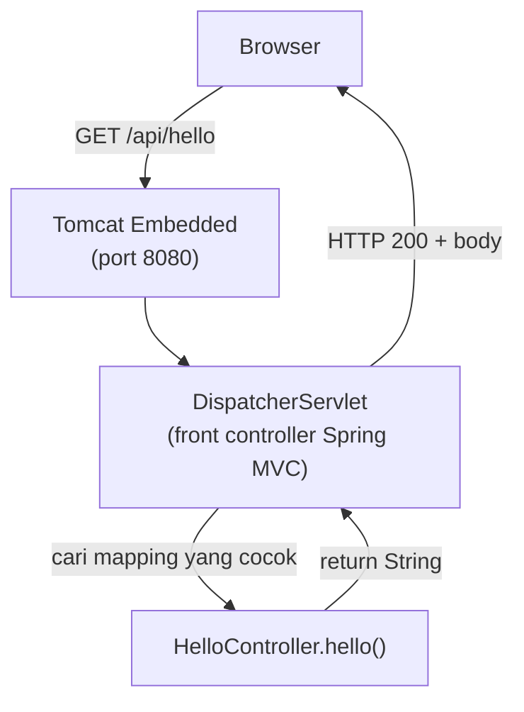

Proyek sudah hidup, strukturnya sudah kita pahami. Sekarang kita tulis **kode aplikasi pertama**: Controller.

Alur aplikasi kita untuk sementara sangat sederhana:

```text
HTTP Request → Controller → HTTP Response
```

Seiring bab berjalan, alurnya akan berkembang menjadi:

```text
HTTP Request → Controller → Service → Repository → Database
```

Tetapi semuanya dimulai dari sini.

---

## 1. Apa Itu Controller?

**Controller** adalah komponen yang menerima request dari client dan menentukan response yang dikembalikan.

Misalnya client mengirim:

```http
GET /api/hello
```

Controller menangkap request itu lalu menjawab:

```text
Hello, Spring Boot!
```

Dalam Spring MVC, controller dibuat dengan annotation `@Controller` atau `@RestController`. Untuk REST API, kita pakai:

```java
@RestController
```

---

## 2. Membuat Controller Pertama

### Buat file baru

```text
src/main/java/com/example/belajarspringboot/controller/HelloController.java
```

Isi lengkapnya:

```java
package com.example.belajarspringboot.controller;

import org.springframework.web.bind.annotation.GetMapping;
import org.springframework.web.bind.annotation.RestController;

@RestController
public class HelloController {

    @GetMapping("/api/hello")
    public String hello() {
        return "Hello, Spring Boot!";
    }

}
```

Tidak ada file lama yang diubah — ini file baru. Struktur proyek kini bertambah satu:

```text
com.example.belajarspringboot
├── BelajarSpringBootApplication.java
└── controller/
    └── HelloController.java
```

::alert{type="warning" icon="lucide:alert-triangle"}
Pastikan package-nya `com.example.belajarspringboot.controller` — persis sesuai lokasi foldernya. Package yang salah = class tidak terdeteksi = endpoint `404` tanpa penjelasan.
::

---

## 3. Membedah Kode Baru Saja Kita

### `@RestController`

Annotation ini memberi tahu Spring dua hal sekaligus:

```text
1. Class ini adalah controller           → method-nya bisa menangani HTTP request
2. Return value = response body          → bukan nama view HTML
```

### `@GetMapping("/api/hello")`

Menandai method di bawahnya sebagai penangani **HTTP GET** untuk path `/api/hello`:

```text
GET /api/hello
      ↓
@GetMapping("/api/hello")
      ↓
hello() dijalankan
      ↓
return "Hello, Spring Boot!"
```

### `public String hello()`

Nama method bebas — yang menentukan pemetaannya adalah annotation, bukan nama method. Type kembalian `String` berarti response body berisi teks tersebut.

---

## 4. Apa Itu Routing?

**Routing** adalah proses memetakan kombinasi **HTTP method + URL** ke handler tertentu.

| HTTP Method | Kegunaan Umum |
| :--- | :--- |
| `GET` | Mengambil data |
| `POST` | Membuat data baru |
| `PUT` | Memperbarui data |
| `PATCH` | Memperbarui sebagian data |
| `DELETE` | Menghapus data |

Nanti saat CRUD, kita akan memakai semuanya:

```text
GET    /api/users      → daftar user
GET    /api/users/1    → detail user
POST   /api/users      → buat user
PUT    /api/users/1    → ubah user
DELETE /api/users/1    → hapus user
```

Sekarang kita baru punya satu endpoint — `GET /api/hello`.

---

## 5. Jalankan dan Uji

::tabs
::tabs-item{label="Windows"}
```powershell
.\mvnw.cmd spring-boot:run
```
::

::tabs-item{label="macOS / Linux"}
```bash
./mvnw spring-boot:run
```
::
::

Buka browser ke:

```text
http://localhost:8080/api/hello
```

Hasil:

```text
Hello, Spring Boot!
```

::alert{type="success" icon="lucide:check"}
Selamat — **REST endpoint pertama kita resmi berjalan.** Perhatikan kita tidak perlu konfigurasi apa pun; component scanning menemukan `@RestController` begitu aplikasi start.
::

---

## 6. Apa yang Sebenarnya Terjadi di Balik Layar?



Kita tidak pernah menyentuh Tomcat maupun `DispatcherServlet` — keduanya dikelola Spring Boot. Controller kita hanya satu komponen kecil di ujung rantai, dan justru itu kekuatannya: **kita fokus menulis logika, infrastruktur HTTP ditangani framework**.

---

## 7. Controller Dikelola oleh Spring

Perhatikan: kita tidak pernah menulis `new HelloController()`. Siapa yang membuat objeknya?

```text
@RestController
      ↓
component scanning menemukan class
      ↓
Spring membuat dan mengelola objeknya (bean)
      ↓
siap menerima request
```

Ini contoh pertama dari konsep **IoC (Inversion of Control)** yang diperkenalkan di [Bab 1](/spring-boot/introduction). Nanti di [Bab 7](/spring-boot/service-dan-dependency-injection), konsep ini berkembang menjadi **Dependency Injection** ketika Controller mulai butuh dependency.

---

## 8. Menambah Endpoint Kedua

Satu controller boleh punya banyak endpoint. Ganti isi `HelloController.java` menjadi:

```java
package com.example.belajarspringboot.controller;

import org.springframework.web.bind.annotation.GetMapping;
import org.springframework.web.bind.annotation.RestController;

@RestController
public class HelloController {

    @GetMapping("/api/hello")
    public String hello() {
        return "Hello, Spring Boot!";
    }

    @GetMapping("/api/greeting")
    public String greeting() {
        return "Welcome to Spring Boot!";
    }

}
```

Uji keduanya:

| URL | Hasil |
| :--- | :--- |
| `http://localhost:8080/api/hello` | `Hello, Spring Boot!` |
| `http://localhost:8080/api/greeting` | `Welcome to Spring Boot!` |

Namun saat aplikasi nanti punya fitur user, endpoint-nya tidak ditaruh di `HelloController` melainkan di `UserController` — pemisahan berdasarkan tanggung jawab.

---

## 9. `@Controller` vs `@RestController`

| | `@Controller` | `@RestController` |
| :--- | :--- | :--- |
| Return value method | Nama **view** (template HTML) | Data langsung (String, JSON, objek) |
| Cocok untuk | Website server-rendered | REST API |
| Annotation gabungan | `@Controller` + `@ResponseBody` per-method | Sudah otomatis `@ResponseBody` untuk semua method |

Karena fokus modul ini REST API, kita pakai `@RestController` sampai akhir.

::tip
Spring juga menyediakan `@RequestMapping`, `@PostMapping`, `@PutMapping`, `@DeleteMapping`, dan `@PatchMapping`. Kita akan pakai varian spesifik (`@GetMapping` dll.) karena membaca HTTP method-nya langsung jelas dari annotation-nya.
::

---

## 10. Masalah Umum

::tabs
::tabs-item{label="404 Not Found"}
Penyebab paling umum, urut dari yang sering:

1. **Package salah** — controller tidak berada di bawah `com.example.belajarspringboot`
2. **URL salah** — endpoint kita `/api/hello`, bukan `/hello`
3. **Lupa restart** — aplikasi harus di-restart setelah menambah controller baru (kalau tidak pakai DevTools)
4. **Aplikasi tidak berjalan** — cek terminal apakah masih hidup
::

::tabs-item{label="405 Method Not Allowed"}
Mapping-nya `@GetMapping` tetapi diakses dengan `POST`. Method HTTP harus cocok. Saat belajar, browser cukup — karena browser mengirim GET secara default.
::

::tabs-item{label="Compile error: package does not exist"}
Import kurang atau salah package. Pastikan kedua import ini ada:

```java
import org.springframework.web.bind.annotation.GetMapping;
import org.springframework.web.bind.annotation.RestController;
```
::

::tabs-item{label="Whitelabel Error Page"}
Kita mengakses URL yang tidak punya mapping (misal `/`). Bukan error — hanya memang belum ada handler-nya.
::
::

---

## 11. Checklist

- [ ] `HelloController.java` dibuat di package `controller`
- [ ] Package-nya `com.example.belajarspringboot.controller`
- [ ] `GET /api/hello` mengembalikan `Hello, Spring Boot!`
- [ ] `GET /api/greeting` mengembalikan `Welcome to Spring Boot!`
- [ ] Pahami peran `@RestController` dan `@GetMapping`
- [ ] Pahami bahwa controller adalah **bean** yang dikelola Spring
- [ ] Pahami perbedaan `@Controller` (view) vs `@RestController` (data)

## Ringkasan

```text
HTTP GET /api/hello
      ↓
DispatcherServlet mencari mapping
      ↓
HelloController.hello()          ← @GetMapping("/api/hello")
      ↓
return "Hello, Spring Boot!"
      ↓
HTTP 200 OK + body
```

Controller kita saat ini masih mengembalikan `String` mentah. REST API sungguhan mengembalikan **data terstruktur (JSON)** dan menerima **input dari client** — itulah topik bab berikutnya.

## Selanjutnya

Lanjut ke [Request dan Response](/spring-boot/request-dan-response).
