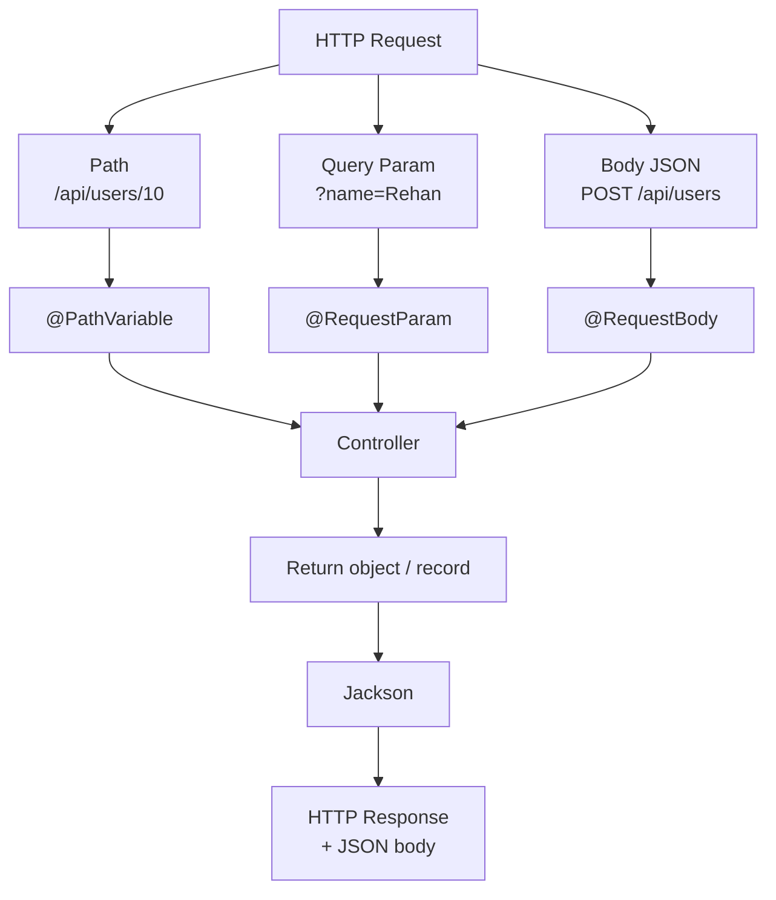

Controller kita saat ini mengembalikan `String` mentah. REST API sungguhan berkomunikasi lewat **JSON** dan menerima **input dari client**. Bab ini membahas keduanya — sambil memperkenalkan fitur Java modern pertama kita: **record**.

---

## 1. Anatomi HTTP Request dan Response

Setiap komunikasi REST API terdiri dari dua sisi:

```text
REQUEST (client → server)          RESPONSE (server → client)
─────────────────────────          ─────────────────────────
GET /api/hello?name=Ehan           200 OK
Header: Accept: application/json   Content-Type: text/plain
Body: (GET biasanya kosong)        Body: Hello, Spring Boot!
```

::tabs
::tabs-item{label="Status Code Penting"}
| Status | Arti | Kapan Dipakai |
| :--- | :--- | :--- |
| `200 OK` | Sukses | GET/PUT berhasil |
| `201 Created` | Resource dibuat | POST berhasil |
| `204 No Content` | Sukses tanpa body | DELETE berhasil |
| `400 Bad Request` | Request tidak valid | Validation gagal |
| `404 Not Found` | Resource tidak ada | ID tidak ditemukan |
| `500 Internal Server Error` | Error di server | Bug / kegagalan tak terduga |
::

::tabs-item{label="Tempat Data di Request"}
Data dari client bisa masuk lewat **tiga pintu**:

```text
1. Path          /api/users/10          → @PathVariable
2. Query param   /api/users?name=Ehan   → @RequestParam
3. Body (JSON)   POST /api/users {...}  → @RequestBody
```

Kita akan praktikkan semuanya di bab ini (body akan dipakai penuh saat CRUD di Bab 9).
::
::

---

## 2. Java Record: Response DTO Modern

Untuk mengembalikan JSON terstruktur, kita butuh class "wadah data". Cara **tradisional** menulisnya panjang:

```java
// ✗ Cara LAMA — boilerplate panjang
public class HelloResponse {
    private String message;

    public HelloResponse(String message) {
        this.message = message;
    }

    public String getMessage() {
        return message;
    }
}
```

Sejak Java 16, Java punya **record** — deklarasi data class dalam satu baris:

```java
// ✓ Cara MODERN — fungsional sama persis
public record HelloResponse(String message) {}
```

Record otomatis menghasilkan constructor, accessor (`message()`), `equals()`, `hashCode()`, dan `toString()`. Kode jadi ringkas, *immutable* (tidak bisa diubah sembarangan), dan bebas boilerplate.

::alert{type="info" icon="lucide:sparkles"}
Jackson (library JSON Spring Boot) mendukung record sepenuhnya — record bisa di-*serialize* ke JSON dan di-*deserialize* dari JSON tanpa konfigurasi tambahan. Inilah standar penulisan DTO di proyek Spring Boot modern.
::

---

## 3. Membuat Response Record

### Buat file baru

```text
src/main/java/com/example/belajarspringboot/controller/HelloResponse.java
```

Isi lengkap:

```java
package com.example.belajarspringboot.controller;

public record HelloResponse(String message) {}
```

Satu baris isi class. Itu bukan salah tulis — memang sesederhana itu.

### Ubah `HelloController.java`

Ganti seluruh isi file menjadi:

```java
package com.example.belajarspringboot.controller;

import org.springframework.web.bind.annotation.GetMapping;
import org.springframework.web.bind.annotation.RestController;

@RestController
public class HelloController {

    @GetMapping("/api/hello")
    public String hello() {
        return "Hello, Spring Boot!";
    }

    @GetMapping("/api/greeting")
    public HelloResponse greeting() {
        return new HelloResponse("Welcome to Spring Boot!");
    }

}
```

Jalankan, lalu buka `http://localhost:8080/api/greeting`:

```json
{
  "message": "Welcome to Spring Boot!"
}
```

**Object Java otomatis berubah menjadi JSON.** Kita tidak menulis satu baris kode JSON pun:

```text
new HelloResponse("Welcome to Spring Boot!")
      ↓
Jackson (message converter)
      ↓
{ "message": "Welcome to Spring Boot!" }
```

---

## 4. Menerima Input: `@RequestParam`

Sekarang kita buat endpoint yang menyapa nama dari query parameter:

```text
GET /api/hello-name?name=Ehan
```

Bagian `?name=Ehan` disebut **query parameter**. Untuk mengambilnya:

```java
@GetMapping("/api/hello-name")
public HelloResponse helloName(@RequestParam String name) {
    return new HelloResponse("Hello, " + name + "!");
}
```

### Ganti seluruh isi `HelloController.java`

```java
package com.example.belajarspringboot.controller;

import org.springframework.web.bind.annotation.GetMapping;
import org.springframework.web.bind.annotation.RequestParam;
import org.springframework.web.bind.annotation.RestController;

@RestController
public class HelloController {

    @GetMapping("/api/hello")
    public String hello() {
        return "Hello, Spring Boot!";
    }

    @GetMapping("/api/greeting")
    public HelloResponse greeting() {
        return new HelloResponse("Welcome to Spring Boot!");
    }

    @GetMapping("/api/hello-name")
    public HelloResponse helloName(@RequestParam String name) {
        return new HelloResponse("Hello, " + name + "!");
    }

}
```

Uji:

```text
http://localhost:8080/api/hello-name?name=Rehan
```

```json
{
  "message": "Hello, Rehan!"
}
```

::alert{type="warning" icon="lucide:alert-triangle"}
Coba buka tanpa parameter: `http://localhost:8080/api/hello-name` → hasilnya **400 Bad Request**. Itu perilaku yang benar! `@RequestParam` tanpa atribut tambahan bersifat **wajib**. Kalau mau opsional:

```java
@RequestParam(required = false, defaultValue = "Guest") String name
```
::

---

## 5. Menerima Input: `@PathVariable`

Bentuk lain input adalah nilai di dalam **path** — misalnya `10` pada `/api/users/10`:

```java
@GetMapping("/api/users/{id}")
public String user(@PathVariable Long id) {
    return "User ID: " + id;
}
```

```text
GET /api/users/10
                ↓
        {id} di mapping cocok
                ↓
        @PathVariable Long id = 10
```

Tambahkan endpoint tersebut ke `HelloController` (jangan lupa import `PathVariable`), lalu uji:

```text
http://localhost:8080/api/users/25   →   User ID: 25
```

---

## 6. `@RequestParam` vs `@PathVariable`

Keduanya mengambil data dari URL, tetapi tempatnya berbeda:

| | `@PathVariable` | `@RequestParam` |
| :--- | :--- | :--- |
| Contoh URL | `/api/users/10` | `/api/users?name=Ehan` |
| Lokasi data | Bagian dari path | Setelah tanda `?` |
| Umum dipakai untuk | Identitas resource (id) | Filter, pencarian, opsi |
| Sifat | Wajib (ada di path) | Bisa wajib / opsional |

Aturan desain REST yang umum: **identitas resource lewat path, modifikasi perilaku lewat query param.**

---

## 7. Konsep Request Body

Ketika client mengirim data baru (misalnya membuat user), data dikirim lewat **body**:

```http
POST /api/users
Content-Type: application/json

{
  "name": "Rehan",
  "email": "rehan@example.com"
}
```

Untuk menangkapnya, Spring menyediakan `@RequestBody`:

```java
@PostMapping("/api/users")
public User createUser(@RequestBody User user) {
    ...
}
```

Kita **belum implementasikan sekarang** — request body yang berguna butuh entity dan database (Bab 8–9). Yang penting pahami alurnya:

```text
JSON body → Jackson → object Java (@RequestBody) → diproses aplikasi
```

---

## 8. `ResponseEntity`: Kontrol Penuh atas Response

Sejauh ini Spring otomatis memberikan status `200 OK`. Untuk mengontrol status secara eksplisit, kita pakai `ResponseEntity`:

```java
@GetMapping("/api/status")
public ResponseEntity<String> status() {
    return ResponseEntity.ok("API is running");   // 200 OK + body
}
```

`ResponseEntity` membungkus tiga hal: **status + header + body**. Ia akan menjadi sangat berguna saat kita menangani `201 Created`, `404 Not Found`, dan `204 No Content` pada bab CRUD.

::tip
Jangan buru-buru membungkus semua endpoint dengan `ResponseEntity` — untuk endpoint sederhana yang selalu `200`, return langsung lebih bersih. Gunakan `ResponseEntity` ketika status memang perlu bervariasi.
::

---

## 9. Peta Lengkap Alur Data



---

## 10. Masalah Umum

::tabs
::tabs-item{label="400 Bad Request saat GET"}
`@RequestParam` wajib tapi tidak dikirim. Tambahkan parameter di URL (`?name=...`) atau beri `defaultValue`.
::

::tabs-item{label="JSON tidak muncul / plain text"}
Return type-nya `String` — Spring mengirim apa adanya. Return sebuah **record/object** agar di-serialize ke JSON.
::

::tabs-item{label="Nama variable path tidak cocok"}
```java
@GetMapping("/api/users/{id}")
public String user(@PathVariable Long userId) { }  // ✗ nama beda
```

Spring mencocokkan nama: `{id}` ↔ `id`. Sesuaikan, atau tulis eksplisit: `@PathVariable("id") Long userId`.
::

::tabs-item{label="Endpoint tidak terdeteksi setelah diedit"}
Restart aplikasi — perubahan kode tidak terbaca otomatis tanpa DevTools. Stop (`Ctrl+C`) lalu jalankan `./mvnw spring-boot:run` lagi.
::
::

---

## 11. Checklist

- [ ] `HelloResponse` dibuat sebagai **record**
- [ ] `GET /api/greeting` mengembalikan JSON
- [ ] `GET /api/hello-name?name=...` membaca query parameter
- [ ] Akses tanpa parameter menghasilkan `400` (perilaku yang benar)
- [ ] `GET /api/users/{id}` membaca path variable
- [ ] Pahami tiga pintu input: path, query param, body
- [ ] Pahami fungsi dasar `ResponseEntity`

## Ringkasan

```text
Client mengirim lewat:
  Path          → @PathVariable   → identitas resource
  Query Param   → @RequestParam   → filter/opsi
  Body JSON     → @RequestBody    → data utama (dipakai saat CRUD)

Controller mengembalikan:
  String        → plain text
  Record/Object → JSON (via Jackson)
  ResponseEntity→ status + header + body dikontrol penuh
```

Controller kita kini bisa menerima input dan mengembalikan JSON. Masalahnya: semua logika masih numpang di Controller. Bab berikutnya kita rapikan dengan **Service**.

## Selanjutnya

Lanjut ke [Service dan Dependency Injection](/spring-boot/service-dan-dependency-injection).
