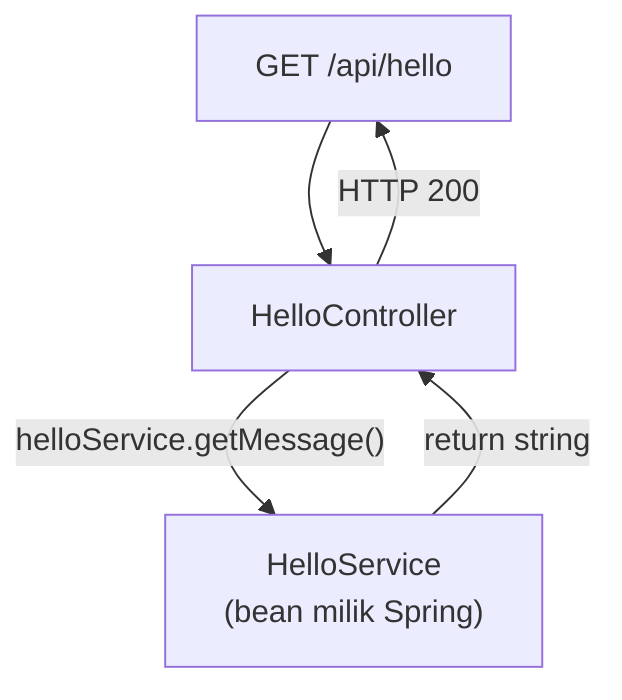
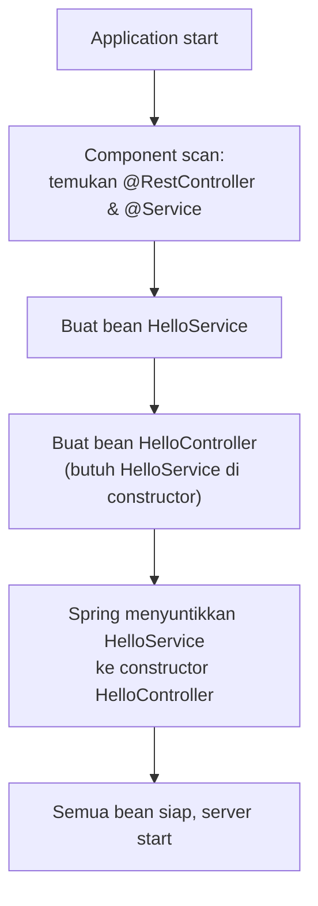

Controller kita sekarang menangani HTTP **dan** mengandung logika. Untuk "Hello World" tidak masalah — tetapi bayangkan bila logikanya berkembang: validasi, perhitungan, aturan bisnis, akses data. Controller akan membengkak dan sulit diuji.

Solusinya: pisahkan logika ke **Service**.

```text
Sekarang:                             Setelah bab ini:
Request → Controller → Response       Request → Controller → Service → Response
```

---

## 1. Apa Itu Service?

**Service** adalah lapisan yang menangani **logika bisnis** — aturan-aturan yang berlaku di aplikasi.

Contoh logika bisnis:

```text
"harga setelah diskon 10%"
"user dengan email sama tidak boleh dibuat dua kali"
"order hanya bisa dibatalkan sebelum dikirim"
```

Semua itu bukan urusan HTTP — jadi tempatnya bukan di Controller.

::card-group
::card{title="Controller" icon="lucide:router"}
Urusan **HTTP**: mapping URL, ambil parameter, susun response. Tidak tahu detail aturan bisnis.
::

::card{title="Service" icon="lucide:cog"}
Urusan **logika**: perhitungan, aturan, orkestrasi. Tidak tahu detail HTTP.
::
::

---

## 2. Membuat Service Pertama

### Buat file baru

```text
src/main/java/com/example/belajarspringboot/service/HelloService.java
```

Isi lengkap:

```java
package com.example.belajarspringboot.service;

import org.springframework.stereotype.Service;

@Service
public class HelloService {

    public String getMessage() {
        return "Hello from Service!";
    }

}
```

### Apa yang dilakukan `@Service`?

```text
@Service
   ↓
component scanning menemukan class
   ↓
Spring membuat objeknya dan menyimpannya di container (menjadi bean)
   ↓
bean siap dipakai komponen lain
```

`@Service` secara teknis adalah *specialization* dari `@Component` — semantiknya lebih spesifik (menandai layer service), itulah mengapa lebih dipilih daripada `@Component` untuk class logika bisnis.

---

## 3. Dependency Injection: Meminta, Bukan Membuat

Controller membutuhkan `HelloService`. Dua cara memenuhi kebutuhan itu:

```java
// ✗ Cara LAMA (anti-pattern di Spring)
public class HelloController {
    private HelloService helloService = new HelloService();
}
```

```java
// ✓ Cara SPRING — dependency diberikan dari luar
public class HelloController {
    private final HelloService helloService;

    public HelloController(HelloService helloService) {
        this.helloService = helloService;
    }
}
```

Cara kedua disebut **Dependency Injection (DI)**. Perbandingannya:

```text
Tanpa DI:                                Dengan DI:
Controller membuat sendiri               Spring menyuntikkan dependency
  → terikat ke implementasi konkret        → longgar, mudah diganti/mock
  → setiap controller punya objek sendiri  → satu objek bersama (singleton)
  → sulit diuji terpisah                   → mudah diuji dengan mock
```

---

## 4. Constructor Injection

Ada beberapa cara DI di Spring (field injection, setter injection). Cara yang direkomendasikan dokumentasi Spring adalah **constructor injection**:

```java
private final HelloService helloService;

public HelloController(HelloService helloService) {
    this.helloService = helloService;
}
```

Dua detail penting:

::tabs
::tabs-item{label="Mengapa tanpa @Autowired?"}
Mungkin kita pernah lihat:

```java
@Autowired
public HelloController(HelloService helloService) { ... }
```

Sejak Spring 4.3, annotation ini **tidak diperlukan bila class hanya punya satu constructor** — Spring otomatis memakainya. Kode kita bersih tanpa annotation.

`@Autowired` baru dibutuhkan bila ada lebih dari satu constructor.
::

::tabs-item{label="Mengapa field final?"}
```java
private final HelloService helloService;
```

`final` berarti referensi tidak bisa diganti setelah objek dibuat. Manfaatnya:

1. **Immutable** — dependency pasti sama sepanjang hidup objek
2. **Dijamin terisi** — compiler memaksa constructor mengisinya
3. **Aman dari NPE** — tidak mungkin `null` saat dipakai
4. **Ramah testing** — objek mudah dibuat manual di test

Ini pola yang dipraktikkan langsung di dokumentasi resmi Spring.
::
::

---

## 5. Menghubungkan Controller ke Service

### Ganti seluruh isi `HelloController.java`

```java
package com.example.belajarspringboot.controller;

import com.example.belajarspringboot.service.HelloService;
import org.springframework.web.bind.annotation.GetMapping;
import org.springframework.web.bind.annotation.PathVariable;
import org.springframework.web.bind.annotation.RequestParam;
import org.springframework.web.bind.annotation.RestController;

@RestController
public class HelloController {

    private final HelloService helloService;

    public HelloController(HelloService helloService) {
        this.helloService = helloService;
    }

    @GetMapping("/api/hello")
    public String hello() {
        return helloService.getMessage();
    }

    @GetMapping("/api/greeting")
    public HelloResponse greeting() {
        return new HelloResponse("Welcome to Spring Boot!");
    }

    @GetMapping("/api/hello-name")
    public HelloResponse helloName(@RequestParam String name) {
        return new HelloResponse("Hello, " + name + "!");
    }

    @GetMapping("/api/users/{id}")
    public String user(@PathVariable Long id) {
        return "User ID: " + id;
    }

}
```

Jalankan, lalu buka `http://localhost:8080/api/hello`:

```text
Hello from Service!
```

Alur di baliknya:



Perhatikan: response berubah dari `Hello, Spring Boot!` menjadi `Hello from Service!` — bukti logika sudah berpindah ke Service.

---

## 6. Contoh Logika Bisnis Nyata

Sekarang Service punya dua method. Ganti isi `HelloService.java`:

```java
package com.example.belajarspringboot.service;

import org.springframework.stereotype.Service;

@Service
public class HelloService {

    public String getMessage() {
        return "Hello from Service!";
    }

    public double calculateDiscount(double price) {
        return price - (price * 0.10);
    }

}
```

Tambahkan endpoint di `HelloController`:

```java
@GetMapping("/api/discount")
public double discount(@RequestParam double price) {
    return helloService.calculateDiscount(price);
}
```

Uji: `http://localhost:8080/api/discount?price=100000` → `90000.0`

Controller hanya meneruskan — perhitungan diskon (logika bisnis) terjadi di Service. Untuk logika sekecil ini perpindahan mungkin terasa formalitas, tetapi bayangkan aturan diskon berkembang: diskon berjenjang, kupon, syarat member. Semua itu tumbuh di satu tempat: **Service**.

---

## 7. Bagaimana Spring Menyusun Semuanya?

Saat aplikasi start, Spring melakukan ini di belakang layar:



Controller dan Service sama-sama bean milik Spring. Kita tidak pernah `new` salah satunya.

::alert{type="info" icon="lucide:info"}
Berdasarkan scope default, bean Spring bersifat **singleton** — satu objek dibagi ke seluruh aplikasi. Karena bean kita tidak menyimpan state yang bisa berubah, pola ini aman dan hemat memori.
::

---

## 8. Struktur Proyek Saat Ini

```text
com.example.belajarspringboot
├── BelajarSpringBootApplication.java
├── controller/
│   ├── HelloController.java
│   └── HelloResponse.java
└── service/
    └── HelloService.java
```

Endpoint yang aktif:

| Endpoint | Fungsi |
| :--- | :--- |
| `GET /api/hello` | Pesan dari Service |
| `GET /api/greeting` | JSON response |
| `GET /api/hello-name?name=...` | Query parameter |
| `GET /api/users/{id}` | Path variable |
| `GET /api/discount?price=...` | Logika bisnis di Service |

---

## 9. Masalah Umum

::tabs
::tabs-item{label="UnsatisfiedDependencyException"}
Spring tidak menemukan bean untuk disuntikkan. Periksa:

1. `HelloService` ada annotation `@Service`?
2. Package-nya `com.example.belajarspringboot.service` (di bawah root)?
3. Constructor controller benar-benar menerima `HelloService`?
::

::tabs-item{label="Controller masih pakai new"}
```java
private HelloService helloService = new HelloService();  // ✗
```

Hapus `new` — pindahkan ke constructor injection. Objek buatan sendiri tidak dikelola Spring: tidak bisa di-mock saat testing, tidak ikut lifecycle bean.
::

::tabs-item{label="Field tidak final"}
```java
private HelloService helloService;   // bisa diubah setelah konstruksi
```

Tambahkan `final` — manfaatnya dibahas di bagian 4.
::

::tabs-item{label="Response tidak berubah"}
Pastikan aplikasi sudah di-restart setelah mengedit. Perubahan Java tidak berlaku tanpa restart (kecuali pakai DevTools).
::
::

---

## 10. Kapan Logika Tidak Harus di Service?

Prinsipnya **pemisahan yang masuk akal**, bukan aturan kaku:

- Format response, pembacaan parameter HTTP → boleh di Controller
- Perhitungan, aturan, keputusan bisnis → Service
- Semua logika "apa pun yang namanya" → jangan dipaksakan ke Service

Yang penting: **Controller tidak mengandung logika bisnis**, dan Service tidak mengandung kode HTTP.

---

## 11. Checklist

- [ ] `HelloService.java` dibuat dengan `@Service`
- [ ] Controller menyuntikkan Service lewat **constructor injection**
- [ ] Field dependency dideklarasikan `private final`
- [ ] Tidak ada `new HelloService()` di kode
- [ ] `GET /api/hello` mengembalikan `Hello from Service!`
- [ ] `GET /api/discount?price=100000` mengembalikan `90000.0`
- [ ] Pahami konsep bean dan singleton default
- [ ] Pahami alasan tanpa `@Autowired` dan alasan `final`

## Ringkasan

```text
Controller       → urusan HTTP (mapping, parameter, response)
Service          → urusan logika bisnis
Hubungan keduanya → constructor injection (field final, tanpa @Autowired)

Spring Container
  ├── HelloController (bean)
  │     └── butuh ↓
  └── HelloService (bean)  ← disuntikkan otomatis
```

Pola Controller → Service akan segera memanjang: Service butuh **Repository** untuk bicara dengan database. Itulah bab berikutnya.

## Selanjutnya

Lanjut ke [Database dan JPA](/spring-boot/database-dan-jpa).
