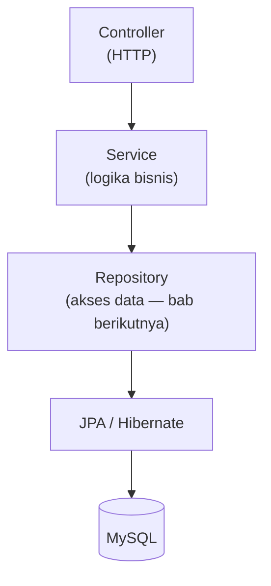

Sampai bab ini, data kita masih "hiasan" — ditulis langsung di kode dan hilang saat aplikasi berhenti. Aplikasi nyata butuh **persistence**: data tersimpan di database dan hidup lebih lama dari aplikasinya.

Alur aplikasi kita mulai memanjang:

```text
Client → Controller → Service → Repository → JPA/Hibernate → Database
```

---

## 1. Konsep: JPA, Hibernate, Spring Data JPA

Tiga istilah ini paling sering tertukar. Mari luruskan sejak awal:

::tabs
::tabs-item{label="JPA — Spesifikasi"}
**JPA (Jakarta Persistence API)** adalah **standar/spesifikasi** persistence Java: kumpulan interface dan annotation (`@Entity`, `@Id`, dll.) yang mendefinisikan *bagaimana* object Java dipetakan ke tabel. JPA tidak punya kode eksekusi — ia cuma "kontrak".

```java
import jakarta.persistence.Entity;   ← ini dari JPA
```
::

::tabs-item{label="Hibernate — Implementasi"}
**Hibernate** adalah framework ORM yang **mengimplementasikan** spesifikasi JPA. Ia yang benar-benar bekerja: menerjemahkan panggilan `save()` menjadi `INSERT INTO ...`, mengelola koneksi, dan sebagainya.

```text
JPA = kontrak          Hibernate = pelaksana kontrak
```
::

::tabs-item{label="Spring Data JPA — Lapisan Kemudahan"}
**Spring Data JPA** berada di atas Hibernate: menyediakan *repository abstraction* sehingga operasi CRUD dasar cukup didefinisikan sebagai **interface** — tanpa menulis implementasinya sama sekali.

```text
Spring Data JPA   (kemudahan — interface repository)
       ↓
JPA               (spesifikasi)
       ↓
Hibernate         (implementasi)
       ↓
MySQL             (database)
```
::
::

::alert{type="info" icon="lucide:info"}
Ketika kita menambah dependency `spring-boot-starter-data-jpa`, ketiganya datang sekaligus sebagai satu paket yang sudah saling terhubung — kita tinggal menulis kode di lapisan teratasnya.
::

---

## 2. Jalankan MySQL dengan Docker Compose

Kita tidak memasang MySQL ke sistem operasi. Buat file **`docker-compose.yml`** di root proyek:

```text
belajar-spring-boot/
├── docker-compose.yml   ← file baru
├── pom.xml
└── src/
```

Isi lengkap:

```yaml
services:
  mysql:
    image: mysql:8.4
    container_name: belajar-spring-boot-mysql
    ports:
      - "3306:3306"
    environment:
      MYSQL_ROOT_PASSWORD: rahasia
      MYSQL_DATABASE: belajar_spring_boot
    volumes:
      - mysql_data:/var/lib/mysql
    healthcheck:
      test: ["CMD", "mysqladmin", "ping", "-h", "localhost", "-prahasia"]
      interval: 5s
      timeout: 3s
      retries: 10

volumes:
  mysql_data:
```

Penjelasan singkat:

| Bagian | Fungsi |
| :--- | :--- |
| `image: mysql:8.4` | MySQL versi **8.4 LTS** — versi dikunci, semua orang dapat yang sama |
| `ports: "3306:3306"` | Expose port database ke host |
| `MYSQL_ROOT_PASSWORD` | Password root container |
| `MYSQL_DATABASE` | Database `belajar_spring_boot` **dibuat otomatis** saat container pertama start |
| `volumes: mysql_data` | Data tersimpan di volume Docker — container dihapus pun data tetap ada |
| `healthcheck` | Docker menunggu MySQL benar-benar siap, bukan baru "hidup" |

### Jalankan

```bash
docker compose up -d
```

Verifikasi:

```bash
docker compose ps
# belajar-spring-boot-mysql  ... (healthy)
```

::tip
Database sudah jalan + otomatis ada database `belajar_spring_boot`. Bandingkan dengan cara lama: install MySQL → buka installer → buat database manual → harap versi MySQL semua orang sama. Docker Compose mengunci semua itu dalam satu file yang di-commit ke Git.
::

Untuk menghentikan: `docker compose stop` (data tetap ada). Menjalankan lagi: `docker compose start` atau `up -d`.

---

## 3. Tambah Dependency JPA dan MySQL Driver

Buka `pom.xml`, tambahkan dua dependency di dalam `<dependencies>`:

```xml
<dependency>
    <groupId>org.springframework.boot</groupId>
    <artifactId>spring-boot-starter-data-jpa</artifactId>
</dependency>

<dependency>
    <groupId>com.mysql</groupId>
    <artifactId>mysql-connector-j</artifactId>
    <scope>runtime</scope>
</dependency>
```

::tip
Tidak perlu menulis `<version>` untuk keduanya — parent POM Spring Boot sudah memilih versi yang kompatibel (termasuk Hibernate 7). `scope=runtime` pada driver artinya: dibutuhkan saat aplikasi berjalan, bukan saat menulis kode.
::

Jalankan ulang aplikasi — Maven akan mengunduh dependency baru.

::alert{type="warning" icon="lucide:alert-triangle"}
Aplikasi akan **gagal start** dengan error koneksi database. Itu wajar dan diharapkan: kita sudah "berjanji" pakai JPA, tapi belum memberi tahu alamat database-nya. Lanjut ke bagian berikutnya.
::

---

## 4. Konfigurasi Koneksi Database

### Ganti seluruh isi `application.properties`

```text
src/main/resources/application.properties
```

```properties
spring.application.name=belajar-spring-boot

spring.datasource.url=jdbc:mysql://localhost:3306/belajar_spring_boot
spring.datasource.username=root
spring.datasource.password=rahasia

spring.jpa.hibernate.ddl-auto=update
spring.jpa.show-sql=true
spring.jpa.properties.hibernate.format_sql=true
```

### Membedah URL JDBC

```text
jdbc:mysql://localhost:3306/belajar_spring_boot
│    │      │         │    │
│    │      │         │    └── nama database
│    │      │         └─────── port MySQL
│    │      └───────────────── host (localhost = komputer sendiri)
│    └──────────────────────── jenis database
└───────────────────────────── protokol JDBC
```

::alert{type="info" icon="lucide:info"}
Password `rahasia` di sini sengaja sama dengan `MYSQL_ROOT_PASSWORD` di `docker-compose.yml` — dua file itu harus cocok. Mengelola credential dengan lebih aman (tanpa menulis langsung di properties) dibahas tuntas di [Bab 11 — Konfigurasi](/spring-boot/konfigurasi-dan-lingkungan).
::

### Memahami `ddl-auto`

| Nilai | Perilaku | Kapan Dipakai |
| :--- | :--- | :--- |
| `none` | Tidak menyentuh schema | **Production** (wajib) |
| `validate` | Hanya memeriksa kecocokan schema | Production + migration tool |
| `update` | Membuat/menyesuaikan tabel dari Entity | **Pembelajaran & development** |
| `create` | Hapus lalu buat ulang tabel tiap start | Eksperimen |
| `create-drop` | Seperti `create`, plus drop saat stop | Testing sesaat |

Kita pakai `update` agar Hibernate otomatis membuat tabel dari Entity yang akan kita tulis.

::alert{type="warning" icon="lucide:alert-triangle"}
`ddl-auto=update` **bukan** pengganti database migration di proyek sungguhan. Standar industri untuk perubahan schema adalah **Flyway** atau **Liquibase** — keduanya dibahas di roadmap [Bab 13](/spring-boot/penutup-dan-roadmap).
::

`show-sql=true` dan `format_sql=true` membuat SQL yang dijalankan Hibernate tampil di console — berguna sekali untuk melihat hubungan kode Java ↔ SQL. Untuk production, keduanya biasanya dimatikan.

---

## 5. Membuat Entity `User`

**Entity** adalah class Java yang dipetakan ke tabel database.

### Buat file baru

```text
src/main/java/com/example/belajarspringboot/entity/User.java
```

Isi lengkap:

```java
package com.example.belajarspringboot.entity;

import jakarta.persistence.Entity;
import jakarta.persistence.GeneratedValue;
import jakarta.persistence.GenerationType;
import jakarta.persistence.Id;
import jakarta.persistence.Table;

@Entity
@Table(name = "users")
public class User {

    @Id
    @GeneratedValue(strategy = GenerationType.IDENTITY)
    private Long id;

    private String name;

    private String email;

    public User() {
    }

    public User(String name, String email) {
        this.name = name;
        this.email = email;
    }

    public Long getId() {
        return id;
    }

    public String getName() {
        return name;
    }

    public void setName(String name) {
        this.name = name;
    }

    public String getEmail() {
        return email;
    }

    public void setEmail(String email) {
        this.email = email;
    }

}
```

---

## 6. Membedah Annotation JPA

::tabs
::tabs-item{label="@Entity dan @Table"}
```java
@Entity
@Table(name = "users")
public class User {
```

- `@Entity` → class ini dipetakan ke tabel database
- `@Table(name = "users")` → nama tabelnya **users** (tanpa ini, default-nya `user` — dan `user` adalah kata kunci khusus di beberapa database, jadi eksplisit lebih aman)
::

::tabs-item{label="@Id dan @GeneratedValue"}
```java
@Id
@GeneratedValue(strategy = GenerationType.IDENTITY)
private Long id;
```

- `@Id` → kolom primary key
- `GenerationType.IDENTITY` → ID dibuat oleh database (auto increment). Kita **tidak pernah** mengisi `id` secara manual — database yang menomori:

```text
save() → INSERT ... → database menghasilkan id = 1, 2, 3, ...
```
::

::tabs-item{label="Konstruktor kosong"}
```java
public User() {
}
```

Spesifikasi JPA mewajibkan entity punya **no-argument constructor** — Hibernate membuat objek lewat jalur itu saat membaca baris database. Constructor `User(String name, String email)` adalah kenyamanan tambahan untuk kita sendiri.
::

::tabs-item{label="Namespace jakarta"}
```java
import jakarta.persistence.Entity;
```

Bukan `javax.persistence` — Spring Boot modern (dan seluruh Jakarta EE 9+) memakai namespace `jakarta`. Tutorial lama yang memakai `javax` pasti pra-2022 dan tidak kompatibel dengan Spring Boot 4.x.
::
::

---

## 7. Jalankan dan Periksa Database

```bash
./mvnw spring-boot:run
```

Log yang diharapkan:

```text
HikariPool-1 - Starting...
HikariPool-1 - Start completed.
Hibernate: create table users (...)
```

Sekarang periksa tabel yang dibuat Hibernate. Masuk ke MySQL container:

```bash
docker exec -it belajar-spring-boot-mysql mysql -uroot -prahasia belajar_spring_boot
```

```sql
SHOW TABLES;
DESCRIBE users;

SELECT * FROM users;
-- Empty set (belum ada data — normal)
```

::alert{type="success" icon="lucide:check"}
Tabel `users` ada → seluruh rantai **Spring Boot → Spring Data JPA → Hibernate → JDBC → MySQL** sudah terhubung. Data-nya sendiri baru mengalir di bab berikutnya saat kita membuat Repository dan CRUD.
::

---

## 8. Repository: Konsepnya Dulu

Kita belum membuat repository — itu porsi penuh bab berikutnya. Yang perlu dipahami sekarang adalah posisinya:



Repository akan menjadi satu-satunya bagian yang boleh bicara dengan database. Service tidak pernah menulis SQL; Controller tidak pernah tahu ada database.

---

## 9. Masalah Umum

::tabs
::tabs-item{label="Communications link failure"}
Aplikasi tidak bisa terhubung ke MySQL. Periksa berurutan:

1. Container hidup? → `docker compose ps` (status harus *healthy*)
2. Nama database di URL cocok dengan `MYSQL_DATABASE`?
3. Port `3306` benar (atau tidak sedang dipakai MySQL host lain)?
4. Username/password di `application.properties` cocok dengan `docker-compose.yml`?
::

::tabs-item{label="Unknown database 'belajar_spring_boot'"}
Container dibuat sebelum ada `MYSQL_DATABASE`. Reset volume:

```bash
docker compose down -v
docker compose up -d
```

(`-v` menghapus volume = data hilang — aman karena memang belum ada data.)
::

::tabs-item{label="Access denied for user 'root'"}
Password di `application.properties` tidak cocok dengan `MYSQL_ROOT_PASSWORD`. Cocokkan keduanya — jangan lupa baris healthcheck juga.
::

::tabs-item{label="Port 3306 sudah dipakai"}
Ada MySQL host berjalan di komputer. Matikan service-nya, atau ganti mapping port di compose: `"3307:3306"` lalu URL menjadi `jdbc:mysql://localhost:3307/...`.
::
::

---

## 10. Checklist

- [ ] `docker-compose.yml` dibuat dan `docker compose up -d` berstatus *healthy*
- [ ] Dependency `spring-boot-starter-data-jpa` + `mysql-connector-j` ada di `pom.xml`
- [ ] `application.properties` terisi konfigurasi datasource
- [ ] Pahami perbedaan **JPA (spesifikasi) / Hibernate (implementasi) / Spring Data JPA (abstraction)**
- [ ] Entity `User` dibuat dengan annotation `jakarta.persistence`
- [ ] Tabel `users` terbentuk di MySQL (dicek via `docker exec`)
- [ ] Pahami nilai-nilai `ddl-auto` dan mengapa `update` hanya untuk development

## Ringkasan

```text
docker-compose.yml       → MySQL 8.4 jalan di container, database auto-created
pom.xml (+JPA +driver)   → Spring tahu kita mau pakai database
application.properties   → alamat, user, dan aturan schema
User entity              → cetak biru tabel users
Hibernate                → membuat tabelnya otomatis (ddl-auto=update)
```

Fondasi database siap — semua pipa terpasang. Sekarang tinggal mengalirkan data: CRUD lengkap di bab berikutnya.

## Selanjutnya

Lanjut ke [CRUD dengan Spring Data JPA](/spring-boot/crud-spring-data-jpa).
