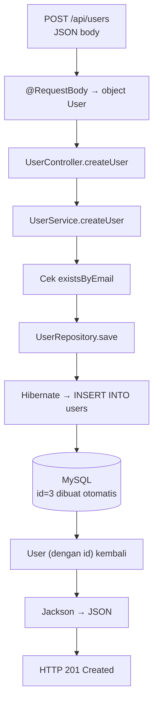

Semua pipa sudah terpasang: aplikasi terhubung ke MySQL dan Entity `User` sudah jadi. Sekarang bagian paling memuaskan — **CRUD lengkap**:

```text
Create → POST   /api/users        (buat user)
Read   → GET    /api/users        (daftar semua)
Read   → GET    /api/users/{id}   (detail satu)
Update → PUT    /api/users/{id}   (ubah user)
Delete → DELETE /api/users/{id}   (hapus user)
```

Dengan alur penuh:

```text
Client → Controller → Service → Repository → Hibernate → MySQL
```

---

## 1. Repository: Interface Tanpa Implementasi

### Buat file baru

```text
src/main/java/com/example/belajarspringboot/repository/UserRepository.java
```

Isi lengkap — ini **seluruhnya**:

```java
package com.example.belajarspringboot.repository;

import com.example.belajarspringboot.entity.User;
import org.springframework.data.jpa.repository.JpaRepository;

public interface UserRepository extends JpaRepository<User, Long> {
}
```

Tidak ada satu method pun yang kita tulis, tidak ada implementasi, tidak ada SQL. Serius.

### Membedah `JpaRepository<User, Long>`

```text
JpaRepository<User, Long>
               │      │
               │      └── tipe ID entity
               └───────── entity yang dikelola
```

Hanya dengan mendeklarasikan interface itu, Spring Data JPA **membuat implementasinya saat runtime** dan mendaftarkannya sebagai bean. Method siap pakai yang kita dapatkan:

| Method | Fungsi |
| :--- | :--- |
| `save(entity)` | Menyimpan / memperbarui |
| `findById(id)` | Cari satu — hasilnya `Optional<T>` |
| `findAll()` | Ambil semua |
| `existsById(id)` | Apakah ada data dengan id itu? |
| `deleteById(id)` | Hapus berdasarkan id |

::alert{type="info" icon="lucide:info"}
Kita tidak perlu menulis `@Repository` pada interface ini — Spring Data JPA otomatis mendaftarkannya. Annotation itu tetap berguna untuk class implementasi buatan sendiri, tetapi interface turunan `JpaRepository` sudah di-handle.
::

---

## 2. Service untuk User

### Buat file baru

```text
src/main/java/com/example/belajarspringboot/service/UserService.java
```

```java
package com.example.belajarspringboot.service;

import com.example.belajarspringboot.entity.User;
import com.example.belajarspringboot.repository.UserRepository;
import org.springframework.stereotype.Service;

import java.util.List;

@Service
public class UserService {

    private final UserRepository userRepository;

    public UserService(UserRepository userRepository) {
        this.userRepository = userRepository;
    }

    public User createUser(User user) {
        return userRepository.save(user);
    }

    public List<User> getAllUsers() {
        return userRepository.findAll();
    }

    public User getUserById(Long id) {
        return userRepository.findById(id)
                .orElseThrow(() -> new RuntimeException("User tidak ditemukan"));
    }

    public User updateUser(Long id, User user) {
        User existingUser = getUserById(id);

        existingUser.setName(user.getName());
        existingUser.setEmail(user.getEmail());

        return userRepository.save(existingUser);
    }

    public void deleteUser(Long id) {
        if (!userRepository.existsById(id)) {
            throw new RuntimeException("User tidak ditemukan");
        }
        userRepository.deleteById(id);
    }

}
```

Dua pola yang layak dicermati:

### Pola 1: Constructor injection

Sama persis seperti bab lalu — `UserService` adalah bean, `UserRepository` adalah dependency-nya, disuntikkan lewat constructor.

### Pola 2: Optional dan orElseThrow

```java
userRepository.findById(id)
        .orElseThrow(() -> new RuntimeException("User tidak ditemukan"));
```

`findById` mengembalikan `Optional<User>` karena data bisa saja **tidak ada**. `orElseThrow` berarti: kalau kosong, lempar exception.

::alert{type="warning" icon="lucide:warning"}
`RuntimeException` di sini **sengaja sementara** — error-nya benar, tetapi responsenya masih jelek (500 Internal Server Error untuk data yang tinggal tidak ditemukan). Kita ganti dengan custom exception di bab berikutnya. Satu langkah per masalah.
::

---

## 3. Controller untuk User

Sebelum membuat `UserController`, ada satu hal yang **wajib dilakukan**: `HelloController` masih memegang endpoint latihan `GET /api/users/{id}` dari [Bab 6](/spring-boot/request-dan-response). Kalau dibiarkan, method itu akan bertabrakan dengan `GET /api/users/{id}` milik `UserController` — Spring menolak start dengan error *Ambiguous mapping* (dua handler untuk satu path).

Hapus endpoint latihan `user(...)` dari `HelloController` sehingga kini isinya:

### Ganti seluruh isi `controller/HelloController.java`

```java
package com.example.belajarspringboot.controller;

import com.example.belajarspringboot.service.HelloService;
import org.springframework.web.bind.annotation.GetMapping;
import org.springframework.web.bind.annotation.RequestParam;
import org.springframework.web.bind.annotation.RestController;

@RestController
public class HelloController {

    private final HelloService helloService;

    public HelloController(HelloService helloService) {
        this.helloService = helloService;
    }

    @GetMapping("/api/hello")
    public String hello() {
        return helloService.getMessage();
    }

    @GetMapping("/api/greeting")
    public HelloResponse greeting() {
        return new HelloResponse("Welcome to Spring Boot!");
    }

    @GetMapping("/api/hello-name")
    public HelloResponse helloName(@RequestParam String name) {
        return new HelloResponse("Hello, " + name + "!");
    }

    @GetMapping("/api/discount")
    public double discount(@RequestParam double price) {
        return helloService.calculateDiscount(price);
    }

}
```

Sekarang rute user sepenuhnya milik `UserController` — sesuai prinsip pemisahan tanggung jawab dari Bab 5.

### Buat file baru

```text
src/main/java/com/example/belajarspringboot/controller/UserController.java
```

```java
package com.example.belajarspringboot.controller;

import com.example.belajarspringboot.entity.User;
import com.example.belajarspringboot.service.UserService;
import org.springframework.http.ResponseEntity;
import org.springframework.web.bind.annotation.*;

import java.util.List;

@RestController
@RequestMapping("/api/users")
public class UserController {

    private final UserService userService;

    public UserController(UserService userService) {
        this.userService = userService;
    }

    @PostMapping
    public ResponseEntity<User> createUser(@RequestBody User user) {
        User saved = userService.createUser(user);
        return ResponseEntity.status(201).body(saved);
    }

    @GetMapping
    public List<User> getAllUsers() {
        return userService.getAllUsers();
    }

    @GetMapping("/{id}")
    public ResponseEntity<User> getUserById(@PathVariable Long id) {
        return ResponseEntity.ok(userService.getUserById(id));
    }

    @PutMapping("/{id}")
    public ResponseEntity<User> updateUser(
            @PathVariable Long id,
            @RequestBody User user
    ) {
        return ResponseEntity.ok(userService.updateUser(id, user));
    }

    @DeleteMapping("/{id}")
    public ResponseEntity<Void> deleteUser(@PathVariable Long id) {
        userService.deleteUser(id);
        return ResponseEntity.noContent().build();
    }

}
```

### Membedah hal-hal baru

::tabs
::tabs-item{label="@RequestMapping pada class"}
```java
@RestController
@RequestMapping("/api/users")
```

Semua mapping method di dalam class mendapat prefix `/api/users`:

```text
@PostMapping            → POST /api/users
@GetMapping("/{id}")    → GET  /api/users/{id}
```

Tanpa prefix, kita harus menulis `/api/users` berulang lima kali — ribet dan rawan typo.
::

::tabs-item{label="201 Created pada POST"}
```java
return ResponseEntity.status(201).body(saved);
```

Ketika resource berhasil **dibuat**, status yang benar secara REST adalah `201 Created`, bukan `200`. Klien juga menerima body berisi user baru (lengkap dengan ID dari database).
::

::tabs-item{label="204 No Content pada DELETE"}
```java
return ResponseEntity.noContent().build();
```

Hapus berhasil → `204 No Content`: sukses tanpa body. Mengirim body "berhasil dihapus" sebenarnya redundan — status code sudah menjelaskan.
::

::tabs-item{label="Entity sebagai request body"}
```java
@PostMapping
public ResponseEntity<User> createUser(@RequestBody User user) {
```

Kita sengaja memakai Entity langsung untuk **tujuan pembelajaran** — alurnya paling jelas terlihat. Di aplikasi nyata, request dipisahkan dari Entity (DTO/Request class) supaya klien tidak bisa mengirim field yang bukan haknya (misalnya `id` atau field internal). Ini justru akan kita rapikan di bab berikutnya.
::
::

---

## 4. Uji CRUD Lengkap

Jalankan aplikasi, lalu pakai Postman/Insomnia/curl. Untuk `curl`:

### Create

```bash
curl -X POST http://localhost:8080/api/users \
  -H "Content-Type: application/json" \
  -d '{"name":"Rehan","email":"rehan@example.com"}'
```

```json
{ "id": 1, "name": "Rehan", "email": "rehan@example.com" }
```

::alert{type="info" icon="lucide:info"}
ID **tidak kita kirim** — `GenerationType.IDENTITY` membuat database yang menomori. Kirim `id` di body create justru salah desain.
::

### Read semua

```bash
curl http://localhost:8080/api/users
```

```json
[
  { "id": 1, "name": "Rehan", "email": "rehan@example.com" },
  { "id": 2, "name": "Budi",  "email": "budi@example.com" }
]
```

### Read satu

```bash
curl http://localhost:8080/api/users/1     → 200 + data
curl http://localhost:8080/api/users/999   → 500 (sementara — diperbaiki di bab berikutnya)
```

### Update

```bash
curl -X PUT http://localhost:8080/api/users/1 \
  -H "Content-Type: application/json" \
  -d '{"name":"Rehan Ramadhan","email":"rehan.ramadhan@example.com"}'
```

Perhatikan: ID tetap `1` — data diubah, bukan dibuat baru.

### Delete

```bash
curl -X DELETE http://localhost:8080/api/users/1   → 204, tanpa body
```

---

## 5. Bonus Modern: Query Method

Sesuatu yang "sihir" tapi sepenuhnya standar. Tambahkan **satu baris** di `UserRepository`:

```java
public interface UserRepository extends JpaRepository<User, Long> {

    boolean existsByEmail(String email);
}
```

Tidak ada implementasi — Spring Data JPA **membuat query-nya dari nama method**: `findBy...` → `WHERE email = ?`, `existsBy...` → `SELECT count(...) > 0`. Lalu pakai di Service:

```java
public User createUser(User user) {
    if (userRepository.existsByEmail(user.getEmail())) {
        throw new RuntimeException("Email sudah dipakai");
    }
    return userRepository.save(user);
}
```

Aturan bisnis sederhana (satu email satu user) terlaksana tanpa satu baris SQL pun. Kembangkan sendiri: `findByNameContainingIgnoreCase`, `findByEmailEndingWith`, dst.

---

## 6. Alur Satu Request Secara Utuh



Inilah alur yang dibangun sejak Bab 5 — kini utuh dari HTTP sampai database dan kembali.

---

## 7. Masalah Umum

::tabs
::tabs-item{label="500 saat GET user yang tidak ada"}
Benar sesuai kode kita — `RuntimeException` belum ditangani khusus. Jadwal bab berikutnya.
::

::tabs-item{label="Kolom email terpotong"}
Default kolom `VARCHAR(255)` cukup untuk belajar. Untuk aturan panjang kolom: `@Column(length = 100)` di Entity. (Perubahan panjang kolom tidak selalu otomatis di-apply `ddl-auto=update` — sesekali cek `DESCRIBE users`.)
::

::tabs-item{label="Data tidak tersimpan"}
Pastikan datanya benar-benar masuk database yang kita cek: `docker exec -it belajar-spring-boot-mysql mysql -uroot -prahasia belajar_spring_boot` lalu `SELECT * FROM users;`. Volume `mysql_data` menjamin data hidup antar restart — `docker compose down` (tanpa `-v`) tidak menghapusnya.
::

::tabs-item{label="415 Unsupported Media Type"}
Request body dikirim tanpa header `Content-Type: application/json` — Spring tidak tahu cara mem-parse-nya.
::
::

---

## 8. Checklist

- [ ] `UserRepository` dibuat sebagai interface tanpa implementasi
- [ ] Pahami arti `JpaRepository<User, Long>`
- [ ] `UserService` dibuat dengan constructor injection
- [ ] `UserController` dibuat dengan prefix `@RequestMapping`
- [ ] POST → **201**, DELETE → **204**
- [ ] CRUD lengkap teruji lewat API client
- [ ] Data benar-benar tersimpan di MySQL container (dicek via `docker exec`)
- [ ] Query method `existsByEmail` berhasil menolak email duplikat

## Ringkasan

```text
UserRepository (interface)     → CRUD dasar gratis dari Spring Data JPA
UserService (@Service)         → aturan bisnis + panggil repository
UserController (@RestController) → mapping HTTP + status code yang benar
existsByEmail()                → query dibuat dari nama method, tanpa SQL

Masalah terbuka:
  1. Data kosong / email duplikat masih diterima  → validation
  2. User tidak ditemukan = 500                    → error handling
  → keduanya dibahas bab berikutnya
```

## Selanjutnya

Lanjut ke [Validation dan Error Handling](/spring-boot/validation-dan-error-handling).
